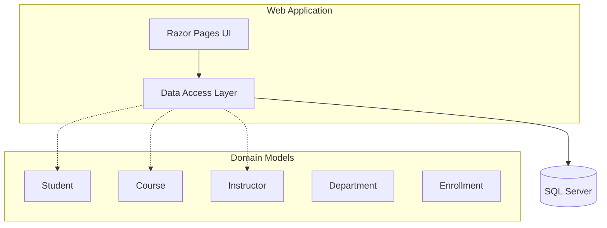

# ContosoUniversity

| Property | Value |
|----------|-------|
| Type | ASP.NET Core Web Application |
| Framework | .NET 6.0 |
| Architecture | Razor Pages |
| Database | SQL Server (LocalDB) |
| ORM | Entity Framework Core 6.0 |

## Application Architecture

<!-- DIAGRAM:architecture -->

## Code Structure

| Component | Location | Responsibility |
|-----------|----------|----------------|
| SchoolContext | Data/SchoolContext.cs | EF Core database context |
| DbInitializer | Data/DbInitializer.cs | Database initialization and seeding |
| Student | Models/Student.cs | Student entity model |
| Course | Models/Course.cs | Course entity model |
| Instructor | Models/Instructor.cs | Instructor entity model |
| Department | Models/Department.cs | Department entity model |
| Enrollment | Models/Enrollment.cs | Student-Course enrollment entity |
| OfficeAssignment | Models/OfficeAssignment.cs | Instructor office assignment entity |
| PaginatedList | PaginatedList.cs | Generic pagination helper |

| Folder | Purpose |
|--------|---------|
| Pages/ | Razor Pages for UI |
| Pages/Students/ | Student management pages |
| Pages/Courses/ | Course management pages |
| Pages/Instructors/ | Instructor management pages |
| Pages/Departments/ | Department management pages |
| Models/ | Domain entity models |
| Data/ | EF Core DbContext and initialization |
| Migrations/ | EF Core database migrations |
| wwwroot/ | Static web assets |

## Technology Stack

| Category | Technologies |
|----------|--------------|
| Runtime | .NET 6.0 |
| Web Framework | ASP.NET Core Razor Pages |
| ORM | Entity Framework Core 6.0.2 |
| Database | SQL Server (LocalDB) |
| Database Tooling | EF Core Tools, EF Core Diagnostics |
| Code Generation | Visual Studio Web Code Generation |
