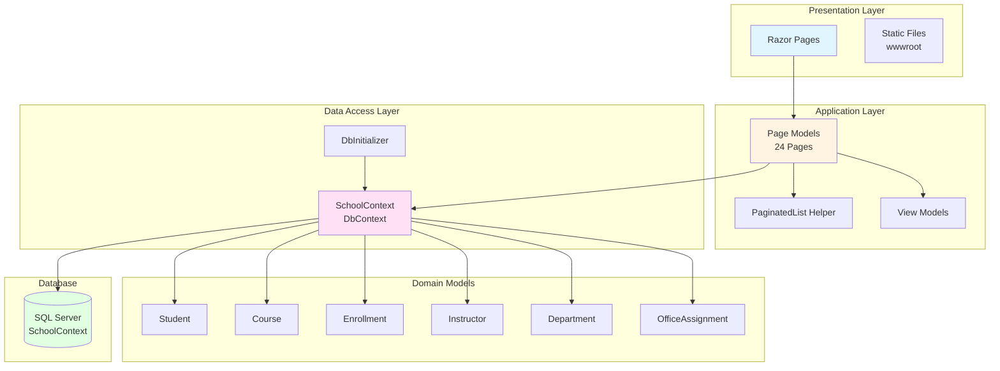
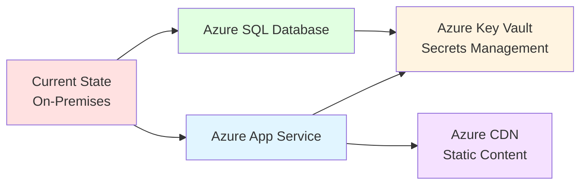

# ContosoUniversity - Application Architecture Diagram

## Overview

ContosoUniversity is a .NET 6.0 ASP.NET Core Razor Pages web application that demonstrates university management functionality using Entity Framework Core with SQL Server.

---

## 1. Application Architecture



---

## 2. Data Model & Relationships

```mermaid
erDiagram
    STUDENT ||--o{ ENROLLMENT : has
    COURSE ||--o{ ENROLLMENT : has
    DEPARTMENT ||--o{ COURSE : contains
    INSTRUCTOR ||--o{ COURSE : teaches
    INSTRUCTOR ||--o| OFFICEASSIGNMENT : has
    DEPARTMENT ||--o{ INSTRUCTOR : employs
    
    STUDENT {
        int ID PK
        string LastName
        string FirstMidName
        DateTime EnrollmentDate
    }
    
    COURSE {
        int CourseID PK
        string Title
        int Credits
        int DepartmentID FK
    }
    
    ENROLLMENT {
        int EnrollmentID PK
        int CourseID FK
        int StudentID FK
        Grade Grade
    }
    
    INSTRUCTOR {
        int ID PK
        string LastName
        string FirstMidName
        DateTime HireDate
    }
    
    DEPARTMENT {
        int DepartmentID PK
        string Name
        decimal Budget
        DateTime StartDate
        int InstructorID FK
    }
    
    OFFICEASSIGNMENT {
        int InstructorID PK_FK
        string Location
    }
```

---

## 3. Application Structure

### Core Components

| Component | Purpose | Location |
|-----------|---------|----------|
| **Program.cs** | Application entry point, service configuration | `/Program.cs` |
| **SchoolContext** | EF Core DbContext for database operations | `/Data/SchoolContext.cs` |
| **DbInitializer** | Seeds initial database data | `/Data/DbInitializer.cs` |
| **Razor Pages** | UI pages for CRUD operations | `/Pages/` |
| **Domain Models** | Entity classes representing business objects | `/Models/` |

### Page Organization (24 Razor Pages)

| Module | Pages | Functionality |
|--------|-------|---------------|
| **Students** | Index, Create, Edit, Delete, Details | Student management |
| **Courses** | Index, Create, Edit, Delete, Details | Course management |
| **Instructors** | Index, Create, Edit, Delete, Details | Instructor management |
| **Departments** | Index, Create, Edit, Delete, Details | Department management |
| **Home** | Index, About, Privacy, Error | Public pages and statistics |

### Domain Models (6 Entities)

| Entity | Key Properties | Relationships |
|--------|---------------|---------------|
| **Student** | ID, LastName, FirstMidName, EnrollmentDate | → Enrollments (1:N) |
| **Course** | CourseID, Title, Credits, DepartmentID | → Enrollments (1:N), → Instructors (N:M), → Department (N:1) |
| **Enrollment** | EnrollmentID, CourseID, StudentID, Grade | → Student (N:1), → Course (N:1) |
| **Instructor** | ID, LastName, FirstMidName, HireDate | → Courses (N:M), → OfficeAssignment (1:1) |
| **Department** | DepartmentID, Name, Budget, StartDate | → Courses (1:N), → Instructors (1:N) |
| **OfficeAssignment** | InstructorID, Location | → Instructor (1:1) |

---

## 4. Technology Stack

### Framework & Runtime

| Technology | Version | Purpose |
|------------|---------|---------|
| **.NET** | 6.0 | Runtime platform |
| **ASP.NET Core** | 6.0 | Web framework |
| **Razor Pages** | 6.0 | UI framework (MVVM pattern) |
| **C#** | 10.0 | Programming language |

### Data Access

| Package | Version | Purpose |
|---------|---------|---------|
| **Entity Framework Core** | 6.0.2 | ORM for data access |
| **EF Core SQL Server** | 6.0.2 | SQL Server provider |
| **EF Core Tools** | 6.0.2 | Migration and tooling |

### Development Tools

| Package | Version | Purpose |
|---------|---------|---------|
| **EF Core Diagnostics** | 6.0.2 | Developer exception page for EF |
| **Code Generation Design** | 6.0.2 | Scaffolding support |

### Front-End Libraries

| Library | Purpose | Location |
|---------|---------|----------|
| **Bootstrap** | CSS framework | `/wwwroot/lib/bootstrap/` |
| **jQuery** | JavaScript library | `/wwwroot/lib/jquery/` |
| **jQuery Validation** | Client-side validation | `/wwwroot/lib/jquery-validation/` |

---

## 5. Configuration

### Connection String
- **Provider**: SQL Server (LocalDB)
- **Database**: SchoolContext
- **Location**: `appsettings.json`
- **Security**: Trusted Connection (Windows Auth)

### Application Settings
- **Page Size**: 3 (pagination)
- **Environment**: Development/Production
- **HTTPS Redirection**: Enabled
- **Static Files**: Enabled (`wwwroot/`)

---

## 6. Migration Considerations (Based on AppCAT Assessment)

### Issues Identified

| Issue | Severity | Migration Impact | Recommendation |
|-------|----------|------------------|----------------|
| **Static Files (33 files)** | Optional | Medium | Use Azure CDN or Azure Storage for static content (CSS, JS, images) |
| **Connection String** | Potential | High | Migrate to Azure Key Vault; update to Azure SQL Database connection string |

### Azure Migration Path



### Target Azure Services

| Service | Purpose | Benefit |
|---------|---------|---------|
| **Azure App Service** | Host web application | PaaS, auto-scaling, easy deployment |
| **Azure SQL Database** | Host database | Managed service, high availability |
| **Azure Key Vault** | Store connection strings & secrets | Enhanced security |
| **Azure CDN** (Optional) | Serve static files | Improved performance, reduced load |
| **Azure Application Insights** (Recommended) | Monitoring & diagnostics | Operational insights |

---

## 7. Application Flow

### Request Processing Pipeline

1. **HTTP Request** → ASP.NET Core Middleware
2. **Routing** → Match to Razor Page route
3. **Page Model** → Execute OnGet/OnPost handler
4. **Data Access** → SchoolContext queries via EF Core
5. **Database** → SQL Server returns data
6. **Model Binding** → Populate Page Model properties
7. **Razor View** → Render HTML with data
8. **HTTP Response** → Return to client

### Database Initialization Flow

1. Application starts (`Program.cs`)
2. Database migration runs automatically
3. `DbInitializer.Initialize()` checks for existing data
4. If empty, seeds initial data (students, courses, enrollments)
5. Application ready to serve requests

---

## 8. Security & Best Practices

### Current Implementation

- ✅ Data validation using Data Annotations
- ✅ HTTPS redirection enabled
- ✅ HSTS for production
- ✅ Developer exception page for development only
- ✅ Database migrations enabled

### Recommended for Azure Migration

- ⚠️ Move connection strings to Azure Key Vault
- ⚠️ Implement Azure AD authentication
- ⚠️ Enable Application Insights for monitoring
- ⚠️ Use managed identities for Azure SQL access
- ⚠️ Implement rate limiting and DDoS protection

---

## Summary

ContosoUniversity is a well-structured ASP.NET Core Razor Pages application following standard MVC patterns with clean separation of concerns. The application is **ready for Azure migration** with minimal changes required—primarily moving secrets to Key Vault and updating database connection strings for Azure SQL Database.

**Migration Effort**: 6 story points (Low complexity)  
**Azure Compatibility**: ✅ Excellent  
**Recommended First Target**: Azure App Service + Azure SQL Database
