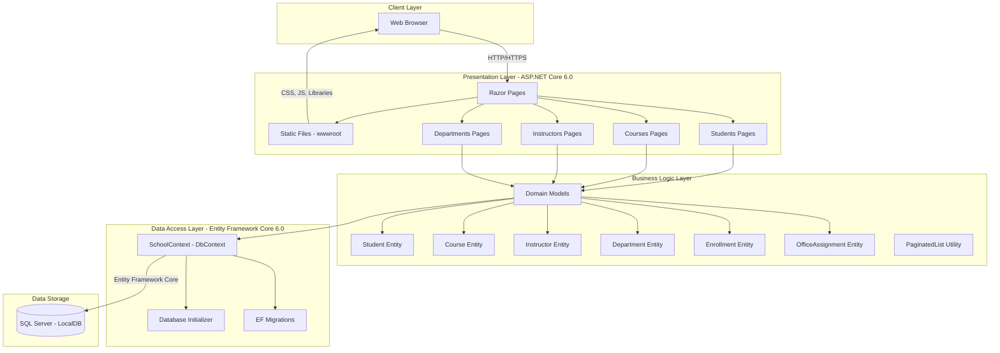

# ContosoUniversity Architecture Diagram

## Application Overview

**Application Name**: ContosoUniversity  
**Application Type**: ASP.NET Core Razor Pages Web Application  
**Framework**: .NET 6.0  
**Architecture Pattern**: Traditional N-Tier Architecture

## Assessment Summary

- **Total Issues Found**: 2
- **Story Points**: 6
- **Severity Breakdown**:
  - Mandatory: 0
  - Optional: 1
  - Potential: 1
  - Information: 0

## Architecture Diagram

## Technology Stack

### Frontend
- **Framework**: ASP.NET Core Razor Pages
- **UI Libraries**: 
  - Bootstrap (CSS framework)
  - jQuery (JavaScript library)
  - jQuery Validation

### Backend
- **Runtime**: .NET 6.0
- **Web Framework**: ASP.NET Core 6.0
- **Architecture**: Razor Pages with Code-Behind

### Data Access
- **ORM**: Entity Framework Core 6.0
- **Database Provider**: Microsoft.EntityFrameworkCore.SqlServer
- **Migration Tool**: EF Core Migrations

### Database
- **Database**: SQL Server LocalDB
- **Connection**: Trusted Connection with MultipleActiveResultSets

## Application Components

### Domain Models
1. **Student** - Student information and enrollments
2. **Course** - Course details and assignments
3. **Instructor** - Instructor information
4. **Department** - Academic department data
5. **Enrollment** - Student course enrollment records
6. **OfficeAssignment** - Instructor office assignments

### Data Context
- **SchoolContext**: Main Entity Framework DbContext managing all entities and database interactions

### Pages Structure
- **Students**: CRUD operations for student management
- **Courses**: Course management interface
- **Instructors**: Instructor management interface
- **Departments**: Department management interface
- **About**: Enrollment statistics page

## Key Features

1. **Entity Relationships**:
   - Many-to-Many: Courses ↔ Instructors
   - One-to-Many: Student → Enrollments
   - One-to-Many: Course → Enrollments
   - One-to-One: Instructor → OfficeAssignment

2. **Data Access Patterns**:
   - Repository pattern via EF Core DbContext
   - Database initialization with seed data
   - Automatic migration on startup

3. **Pagination Support**:
   - PaginatedList utility for paging results
   - Configurable page size via appsettings.json

## Assessment Issues

### Issue 1: Static Files (Scale.0001)
- **Severity**: Optional
- **Effort**: 3 story points
- **Category**: Scale
- **Description**: 33 static files detected in wwwroot folder
- **Recommendation**: Consider using CDN for static assets when migrating to Azure

### Issue 2: Connection (Potential)
- **Severity**: Potential
- **Effort**: 3 story points
- **Category**: Connection
- **Description**: Local database connection (SQL Server LocalDB)
- **Recommendation**: Update connection string for Azure SQL Database

## Configuration

- **Connection String**: Uses SQL Server LocalDB with Trusted Connection
- **Page Size**: Configured at 3 records per page
- **Logging**: Information level for general logs, Warning for ASP.NET Core

## Deployment Considerations

Based on the assessment, this application can be migrated to:
- Azure App Service (Windows/Linux)
- Azure Kubernetes Service (AKS)
- Azure Container Apps (ACA)
- Azure App Service Container

**Next Steps for Azure Migration**:
1. Update connection string to use Azure SQL Database
2. Consider Azure CDN for static files optimization
3. Configure application settings in Azure App Service
4. Set up CI/CD pipeline for automated deployments
