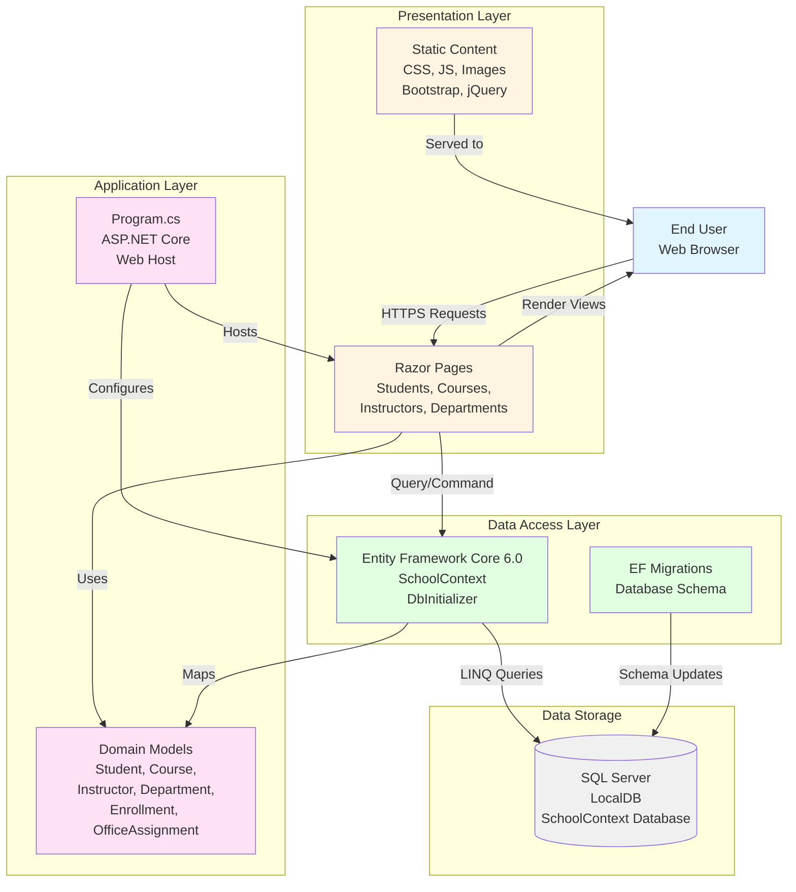

# ContosoUniversity Application Architecture

This diagram represents the architecture of the ContosoUniversity application based on the assessment analysis.

## Application Overview

- **Application Type**: ASP.NET Core 6.0 Razor Pages Web Application
- **Framework**: .NET 6.0
- **Pattern**: Page-based MVC with Entity Framework Core
- **Assessment Date**: 2026-02-07
- **Total Issues Found**: 2 (1 Optional, 1 Potential)
- **Total Effort**: 6 story points

## Architecture Diagram

## Technology Stack

### Frontend
- **UI Framework**: ASP.NET Core Razor Pages
- **CSS Framework**: Bootstrap 5
- **JavaScript Libraries**: jQuery, jQuery Validation

### Backend
- **Framework**: .NET 6.0 (Microsoft.NET.Sdk.Web)
- **Runtime**: ASP.NET Core 6.0
- **Programming Language**: C# with implicit usings

### Data Access
- **ORM**: Entity Framework Core 6.0
- **Database Provider**: Microsoft.EntityFrameworkCore.SqlServer 6.0.2
- **Migration Tool**: Entity Framework Core Migrations
- **Connection String**: Managed in appsettings.json

### Database
- **Database**: SQL Server (LocalDB for development)
- **Database Name**: SchoolContext
- **Features**: Multiple Active Result Sets (MARS)

## Application Components

### Domain Models
1. **Student** - Student information and enrollments
2. **Course** - Course catalog and details
3. **Instructor** - Faculty information
4. **Department** - Academic department structure
5. **Enrollment** - Student course registrations
6. **OfficeAssignment** - Instructor office locations

### Page Groups
1. **Students** - Student CRUD operations
2. **Courses** - Course management
3. **Instructors** - Instructor management
4. **Departments** - Department management
5. **About** - Statistics and reporting

### Data Layer
- **SchoolContext**: EF Core DbContext for database operations
- **DbInitializer**: Seed data for development/testing
- **Migrations**: Database schema version control

## Assessment Findings

### Issue 1: Static Content Handling (Optional - 3 story points)
- **Category**: Scale
- **Severity**: Optional
- **Location**: wwwroot folder (33 static files)
- **Description**: Static content (CSS, JS, images) is served directly from the application
- **Recommendation**: Move static content to Azure Blob Storage with Azure CDN for better scalability and performance

### Issue 2: Connection String Management (Potential - 3 story points)
- **Category**: Connection
- **Severity**: Potential
- **Location**: appsettings.json
- **Description**: Connection string to SQL Server LocalDB detected
- **Recommendation**: 
  - Migrate database to Azure SQL Database for managed service benefits
  - Consider Azure SQL Managed Instance for advanced SQL Server features
  - Use Azure Key Vault for secure connection string storage
  - Use managed identities for authentication

## Migration Targets

The application is compatible with the following Azure targets:
- Azure App Service (Windows/Linux)
- Azure Kubernetes Service (AKS)
- Azure Container Apps (ACA)
- Azure App Service Container

## Configuration Files

- **appsettings.json**: Application settings, connection strings, logging configuration
- **appsettings.Development.json**: Development-specific overrides
- **Program.cs**: Application startup and configuration

## Next Steps

1. **Address Static Content**: Evaluate moving static assets to Azure Blob Storage + CDN
2. **Database Migration**: Plan migration from SQL Server LocalDB to Azure SQL Database
3. **Security**: Move connection strings to Azure Key Vault
4. **Authentication**: Implement Azure AD integration if needed
5. **Monitoring**: Add Application Insights for observability

---

*This diagram was automatically generated from the AppCAT assessment on 2026-02-07*
