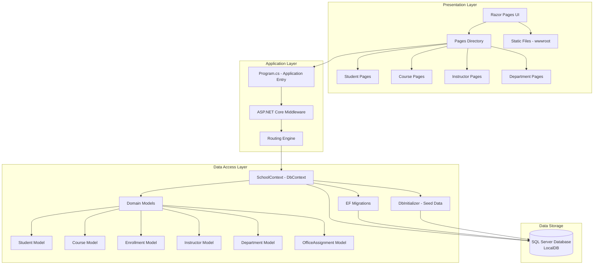

# ContosoUniversity Application Architecture

## Overview

ContosoUniversity is a .NET 6.0 web application built using ASP.NET Core Razor Pages. It demonstrates a typical three-tier web application architecture for managing university data including students, courses, instructors, and departments.

## Technology Stack

- **Framework**: ASP.NET Core 6.0 (Razor Pages)
- **Language**: C#
- **ORM**: Entity Framework Core 6.0.2
- **Database**: SQL Server (LocalDB)
- **UI Framework**: Bootstrap 5
- **JavaScript Libraries**: jQuery, jQuery Validation

## Architecture Diagram

## Application Components

### Presentation Layer
- **Razor Pages**: Server-side rendered web pages with code-behind
- **Static Files**: CSS, JavaScript, and images served from wwwroot
- **Bootstrap UI**: Responsive design framework
- **jQuery**: Client-side interactions and validation

### Application Layer
- **Program.cs**: Application startup and configuration
- **Middleware Pipeline**: Request processing, authentication, error handling
- **Routing**: Maps URLs to Razor Pages
- **Dependency Injection**: Service registration and resolution

### Data Access Layer
- **SchoolContext**: Entity Framework Core DbContext for database operations
- **Domain Models**: Entity classes representing database tables
  - Student
  - Course
  - Enrollment (many-to-many relationship)
  - Instructor
  - Department
  - OfficeAssignment
- **DbInitializer**: Seeds initial data into the database
- **Migrations**: Database schema versioning and updates

### Data Storage
- **SQL Server LocalDB**: Development database for local testing
- **Connection String**: Configured in appsettings.json

## Key Features

1. **Student Management**: CRUD operations for student records
2. **Course Management**: Course creation and management
3. **Instructor Management**: Instructor profiles and office assignments
4. **Department Management**: Academic department organization
5. **Enrollment Tracking**: Student-course enrollment relationships
6. **Data Seeding**: Automatic initialization with sample data
7. **Pagination**: Built-in pagination support for list views

## Database Schema

The application uses Entity Framework Core with the following key relationships:

- **Student** → **Enrollment** (One-to-Many)
- **Course** → **Enrollment** (One-to-Many)
- **Course** ↔ **Instructor** (Many-to-Many)
- **Department** → **Course** (One-to-Many)
- **Instructor** → **OfficeAssignment** (One-to-One)

## Configuration

- **appsettings.json**: Application configuration including connection strings
- **Page Size**: Configurable pagination (default: 3)
- **Logging**: Configured for development and production environments
- **HTTPS**: Enabled with redirection
- **Static Files**: Served from wwwroot directory

## Assessment Findings

Based on the AppCAT assessment report:

- **Total Issues Found**: 2
- **Total Incidents**: 2
- **Estimated Effort**: 6 story points
- **Issue Categories**:
  - Scale.0001: Static files in wwwroot (optional, 3 story points)
  - Connection issue (potential, 3 story points)

### Recommendations

1. **Static Files**: Consider using CDN for static assets (Bootstrap, jQuery) to improve scalability
2. **Database Connection**: Review connection string configuration for cloud deployment
3. **Modernization**: Application is ready for Azure migration with minimal changes
4. **Target Platforms**: Compatible with Azure App Service, Azure Kubernetes Service, and Azure Container Apps

## Migration Considerations

The application architecture is well-suited for cloud migration:

- ✅ Modern .NET 6.0 framework
- ✅ Entity Framework Core for database abstraction
- ✅ Configuration-based connection strings
- ✅ Stateless web application design
- ⚠️ Consider externalizing static files to Azure CDN
- ⚠️ Update connection string for Azure SQL Database

---

*Generated by assessment-diagram skill on 2026-02-07*
