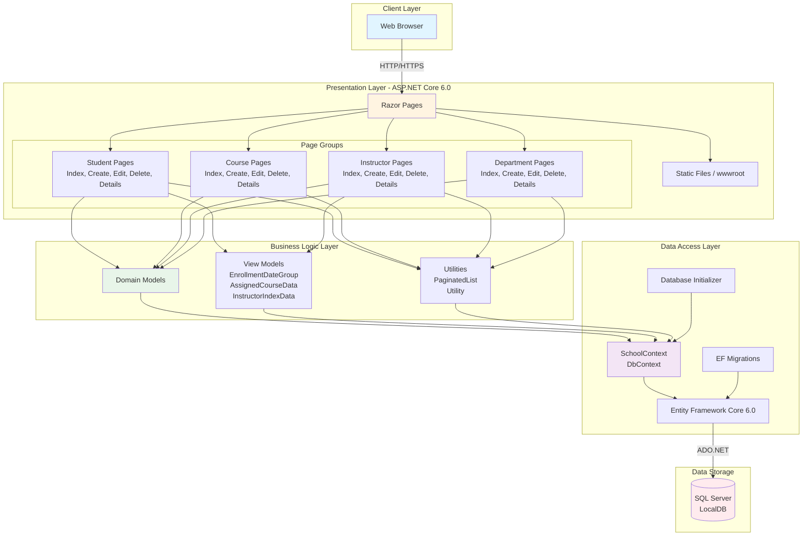

# ContosoUniversity Application Architecture Diagram

## Overview
ContosoUniversity is an ASP.NET Core 6.0 web application built with Razor Pages and Entity Framework Core, designed to manage university data including students, courses, instructors, and departments.

## Architecture Diagram

## Technology Stack

### Frontend
- **Framework**: ASP.NET Core 6.0 Razor Pages
- **UI Pattern**: Server-side rendering with Razor syntax
- **Static Assets**: wwwroot directory for CSS, JavaScript, images

### Backend
- **Runtime**: .NET 6.0
- **Web Framework**: ASP.NET Core 6.0
- **Architecture Pattern**: Page-based MVC (Razor Pages)

### Data Access
- **ORM**: Entity Framework Core 6.0
- **Database Provider**: Microsoft.EntityFrameworkCore.SqlServer
- **Migration Strategy**: Code-First with EF Migrations

### Database
- **Database**: SQL Server (LocalDB for development)
- **Connection**: Trusted Connection with Multiple Active Result Sets

### Development Tools
- **Diagnostics**: Microsoft.AspNetCore.Diagnostics.EntityFrameworkCore
- **Code Generation**: Microsoft.VisualStudio.Web.CodeGeneration.Design
- **Database Tools**: Entity Framework Core Tools

## Domain Model

The application manages the following core entities:

1. **Student**: Represents university students
2. **Course**: Represents academic courses
3. **Instructor**: Represents teaching faculty
4. **Department**: Represents academic departments
5. **Enrollment**: Links students to courses
6. **OfficeAssignment**: Links instructors to office locations

## Key Features

- **CRUD Operations**: Full Create, Read, Update, Delete operations for all entities
- **Pagination**: Built-in pagination support via PaginatedList utility
- **Database Initialization**: Automatic database creation and seeding with test data
- **Auto-Migration**: Database migrations run automatically on application startup
- **Developer Experience**: 
  - Database Developer Page Exception Filter in development
  - Migrations Endpoint for database management

## Data Flow

1. **User Request**: Browser sends HTTP/HTTPS request to ASP.NET Core
2. **Routing**: Request routed to appropriate Razor Page
3. **Page Processing**: Razor Page interacts with domain models and DbContext
4. **Data Access**: Entity Framework Core translates LINQ queries to SQL
5. **Database Query**: SQL Server executes queries and returns data
6. **Response**: EF Core materializes objects, Razor Page renders HTML
7. **Browser Rendering**: HTML response sent back to browser

## Assessment Summary

**Total Issues Found**: 2  
**Total Incidents**: 2  
**Effort Required**: 6 story points  

**Issue Breakdown**:
- **Mandatory**: 0
- **Optional**: 1
- **Potential**: 1
- **Information**: 0

**Categories**:
- **Scale**: 1 issue
- **Connection**: 1 issue

**Target Platforms**: Azure App Service, Azure Kubernetes Service, Azure Container Apps, Azure App Service Container

**Supported OS**: Windows, Linux

## Notes

- The application uses LocalDB for development, which will need to be replaced with Azure SQL Database or SQL Server for cloud deployment
- The application is designed for .NET 6.0, which is supported on multiple Azure platforms
- Assessment identified 2 issues related to scaling and connectivity that should be addressed before cloud migration
