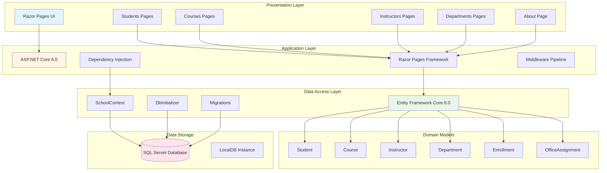

# ContosoUniversity - Architecture Diagram

## Application Overview

**ContosoUniversity** is a .NET 6.0 web application built with ASP.NET Core and Razor Pages, demonstrating a university management system with student, course, instructor, and department management capabilities.

## Architecture Diagram

## Technology Stack

### Frontend
- **Framework**: ASP.NET Core Razor Pages
- **UI Components**: HTML, CSS, Bootstrap (via wwwroot)
- **Client-Side**: Static files served from wwwroot

### Backend
- **Runtime**: .NET 6.0
- **Web Framework**: ASP.NET Core 6.0
- **Architecture Pattern**: Razor Pages (Page-based MVC)
- **Dependency Injection**: Built-in ASP.NET Core DI

### Data Access
- **ORM**: Entity Framework Core 6.0
- **Database Provider**: Microsoft.EntityFrameworkCore.SqlServer
- **Migration Support**: EF Core Migrations
- **Database Initialization**: Custom DbInitializer with seed data

### Database
- **Type**: SQL Server
- **Development Instance**: LocalDB (mssqllocaldb)
- **Connection**: Trusted Connection with Multiple Active Result Sets
- **Database Name**: SchoolContext

### Development Tools
- **Diagnostics**: Entity Framework Core Developer Page Exception Filter
- **Code Generation**: Microsoft.VisualStudio.Web.CodeGeneration.Design

## Application Components

### Domain Models
The application manages the following entities:

1. **Student** - Student information and enrollment data
2. **Course** - Course catalog and details
3. **Instructor** - Instructor profiles and assignments
4. **Department** - Academic departments
5. **Enrollment** - Student course enrollments (junction table)
6. **OfficeAssignment** - Instructor office assignments

### Key Features
- **CRUD Operations**: Create, Read, Update, Delete for all entities
- **Relationships**: Many-to-many between Courses and Instructors, one-to-many for other entities
- **Pagination**: Implemented via PaginatedList helper
- **Database Seeding**: Automatic initialization with sample data
- **Auto Migration**: Database migrations run automatically on startup

## Data Flow

1. **User Request**: Browser sends HTTP request to Razor Page
2. **Routing**: ASP.NET Core routes request to appropriate PageModel
3. **Page Processing**: PageModel interacts with SchoolContext (EF Core)
4. **Database Query**: EF Core translates LINQ queries to SQL
5. **Data Retrieval**: SQL Server returns data
6. **Model Binding**: Data bound to view models
7. **Page Rendering**: Razor view generates HTML
8. **Response**: HTML sent back to browser

## Configuration

- **Connection String**: Configured in appsettings.json
- **Logging**: Microsoft.AspNetCore logging with configurable levels
- **Page Size**: Configurable pagination (default: 3 items per page)
- **HTTPS**: Enabled with HSTS for production
- **Static Files**: Served from wwwroot directory

## Deployment Considerations

Based on the architecture:
- **Target Platform**: Azure App Service, Azure Container Apps, or Azure Kubernetes Service
- **Database Migration**: SQL Server on Azure (Azure SQL Database recommended)
- **Configuration**: Use Azure App Configuration or Key Vault for secrets
- **Scalability**: Stateless design supports horizontal scaling
- **Monitoring**: Application Insights recommended for production monitoring
