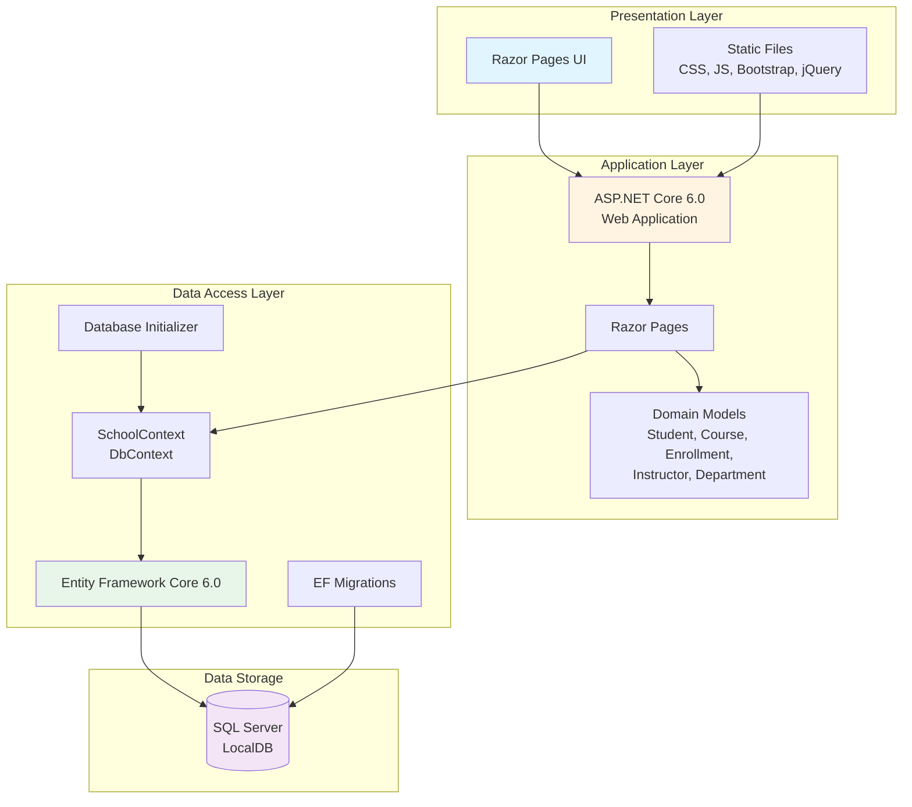

# ContosoUniversity Application Architecture

## Overview

ContosoUniversity is an ASP.NET Core 6.0 web application that demonstrates a university student information system using Razor Pages and Entity Framework Core.

## Architecture Diagram

## Technology Stack

### Framework & Runtime
- **Framework**: ASP.NET Core 6.0 (.NET 6)
- **Project Type**: Web Application (Razor Pages)
- **Language**: C#

### Frontend
- **UI Framework**: ASP.NET Core Razor Pages
- **CSS Framework**: Bootstrap 5
- **JavaScript**: jQuery
- **Validation**: jQuery Validation & Unobtrusive Validation

### Backend
- **ORM**: Entity Framework Core 6.0.2
- **Data Provider**: Microsoft.EntityFrameworkCore.SqlServer 6.0.2
- **Diagnostics**: Microsoft.AspNetCore.Diagnostics.EntityFrameworkCore 6.0.2

### Data Storage
- **Database**: SQL Server (LocalDB for development)
- **Connection String**: Uses trusted connection to LocalDB instance
- **Migrations**: EF Core Code-First Migrations

### Development Tools
- **Code Generation**: Microsoft.VisualStudio.Web.CodeGeneration.Design 6.0.2
- **Build System**: MSBuild (via .NET SDK)

## Application Layers

### 1. Presentation Layer
- Razor Pages for server-side rendered UI
- Static files (CSS, JavaScript, images) served from wwwroot
- Bootstrap for responsive design
- jQuery for client-side interactivity

### 2. Application Layer
- **Pages/**: Razor Pages for handling HTTP requests and rendering views
- **Models/**: Domain entities (Student, Course, Instructor, Department, Enrollment, OfficeAssignment)
- **PaginatedList.cs**: Utility for pagination support
- **Program.cs**: Application startup and configuration

### 3. Data Access Layer
- **Data/SchoolContext.cs**: EF Core DbContext managing entity sets
- **Data/DbInitializer.cs**: Seeds initial data for development
- **Migrations/**: EF Core migration files for database schema versioning

### 4. Data Storage
- SQL Server database (LocalDB for development)
- Connection string configured in appsettings.json
- Automatic migration on application startup

## Key Features

1. **Student Management**: CRUD operations for student records
2. **Course Management**: Course catalog and enrollment tracking
3. **Instructor Management**: Faculty information and assignments
4. **Department Management**: Academic department organization
5. **Pagination**: Built-in support for paginated lists
6. **Automatic Migrations**: Database schema updates on startup
7. **Developer Experience**: Enhanced error pages and migration endpoint in development

## Configuration

- **PageSize**: Configured in appsettings.json (default: 3)
- **Logging**: ASP.NET Core logging with configurable levels
- **HTTPS**: HTTPS redirection enabled
- **HSTS**: HTTP Strict Transport Security in production
- **Authorization**: Middleware configured (ready for authentication implementation)

## Assessment Findings

Based on the AppCAT assessment report:

- **Total Issues**: 2
- **Story Points**: 6
- **Issue Categories**:
  - **Scale** (Optional): Static files bundling optimization recommended
  - **Connection** (Potential): Connection string configuration for cloud deployment

### Migration Considerations

The application is ready for Azure deployment with minor adjustments:

1. **Static Files**: Consider using Azure CDN or blob storage for static assets
2. **Database**: Update connection string for Azure SQL Database
3. **Configuration**: Use Azure App Configuration or Key Vault for secrets
4. **Scalability**: Application follows standard ASP.NET Core patterns suitable for cloud deployment

## Data Flow

1. User requests a page via browser
2. ASP.NET Core routing directs to appropriate Razor Page
3. Razor Page handler method processes request
4. Page interacts with SchoolContext (EF Core) to query/update data
5. EF Core translates LINQ queries to SQL and executes against SQL Server
6. Results are mapped back to domain models
7. Razor Page renders HTML with data
8. Response sent back to browser

## External Dependencies

- **Bootstrap**: Frontend CSS framework (bundled in wwwroot)
- **jQuery**: JavaScript library (bundled in wwwroot)
- **jQuery Validation**: Client-side form validation (bundled in wwwroot)
- **SQL Server**: Database engine (LocalDB for development)

---

*Generated from AppCAT assessment results on 2026-02-07*
