# ContosoUniversity Architecture Diagram

## Application Overview

**ContosoUniversity** is a .NET 6.0 ASP.NET Core web application that demonstrates a university management system. The application follows a traditional three-tier architecture pattern with Razor Pages for the presentation layer, business logic in the middle tier, and Entity Framework Core for data access.

## Technology Stack

- **Framework**: .NET 6.0
- **Web Framework**: ASP.NET Core with Razor Pages
- **ORM**: Entity Framework Core 6.0.2
- **Database**: SQL Server (LocalDB)
- **UI Libraries**: Bootstrap 5, jQuery, jQuery Validation

## Architecture Diagram

```mermaid
graph TB
    subgraph "Presentation Layer"
        A[Razor Pages UI]
        A1[Students Pages]
        A2[Courses Pages]
        A3[Instructors Pages]
        A4[Departments Pages]
        A5[About Page]
    end
    
    subgraph "Application Layer"
        B[ASP.NET Core Pipeline]
        B1[Routing]
        B2[Authorization]
        B3[Static Files]
        B4[HTTPS Redirection]
    end
    
    subgraph "Business Logic Layer"
        C[Page Models]
        C1[Student Management]
        C2[Course Management]
        C3[Instructor Management]
        C4[Department Management]
        D[Utilities]
        D1[PaginatedList]
    end
    
    subgraph "Data Access Layer"
        E[SchoolContext DbContext]
        E1[DbSet Students]
        E2[DbSet Courses]
        E3[DbSet Instructors]
        E4[DbSet Departments]
        E5[DbSet Enrollments]
        E6[DbSet OfficeAssignments]
        F[Entity Framework Core]
        G[DbInitializer]
    end
    
    subgraph "Domain Models"
        M1[Student]
        M2[Course]
        M3[Instructor]
        M4[Department]
        M5[Enrollment]
        M6[OfficeAssignment]
    end
    
    subgraph "Data Storage"
        H[(SQL Server Database)]
        H1[SchoolContext DB]
    end
    
    subgraph "Static Resources"
        I[wwwroot]
        I1[CSS - Bootstrap]
        I2[JavaScript - jQuery]
        I3[Validation Libraries]
    end
    
    A --> B
    A1 --> C1
    A2 --> C2
    A3 --> C3
    A4 --> C4
    A5 --> C
    
    B --> B1
    B --> B2
    B --> B3
    B --> B4
    
    C --> E
    C1 --> D1
    C2 --> D1
    C3 --> D1
    C4 --> D1
    
    E --> F
    E --> E1
    E --> E2
    E --> E3
    E --> E4
    E --> E5
    E --> E6
    
    E1 --> M1
    E2 --> M2
    E3 --> M3
    E4 --> M4
    E5 --> M5
    E6 --> M6
    
    F --> H
    G --> H
    
    A --> I
    I --> I1
    I --> I2
    I --> I3
    
    style A fill:#e1f5ff
    style B fill:#fff4e1
    style C fill:#e8f5e8
    style E fill:#ffe8f5
    style H fill:#f5e8e8
    style I fill:#f0f0f0
```

## Component Details

### Presentation Layer
- **Razor Pages**: Server-side rendered pages with code-behind model
- **CRUD Operations**: Full Create, Read, Update, Delete functionality for all entities
- **Pagination**: Implemented via PaginatedList utility class
- **Responsive UI**: Bootstrap-based responsive design

### Application Middleware
- **HTTPS Redirection**: Enforces secure connections
- **Static File Serving**: Serves CSS, JavaScript, and other static assets
- **Developer Exception Page**: Development-time error handling
- **Database Migration Endpoint**: Development-time database management

### Business Logic
- **Page Models**: Handle user interactions and coordinate between UI and data layer
- **Validation**: Data annotation-based validation on models
- **Pagination Logic**: Reusable pagination across entity lists

### Data Access Layer
- **SchoolContext**: EF Core DbContext managing database operations
- **Entity Configurations**: Fluent API configurations for relationships
- **Migrations**: EF Core Migrations for database schema management
- **Seed Data**: DbInitializer provides initial test data

### Domain Models
- **Student**: Student information and enrollments
- **Course**: Course details with department and instructor relationships
- **Instructor**: Faculty information with office assignments
- **Department**: Academic departments with budgets and administrators
- **Enrollment**: Student course enrollments with grades
- **OfficeAssignment**: One-to-one relationship with instructors

### Data Storage
- **SQL Server LocalDB**: Development database
- **Connection String**: Configured in appsettings.json
- **Auto-Migration**: Database automatically migrated on application startup

## Data Flow

1. **User Request** → Razor Page
2. **Page Model** → Processes request, validates input
3. **SchoolContext** → Queries/Updates database via EF Core
4. **SQL Server** → Persists/retrieves data
5. **Response** → Page Model processes results
6. **Rendered Page** → Returns HTML to user

## Assessment Summary

**Assessment Results**: 2 issues found with 6 story points total

### Issues by Category:
- **Scale**: 1 issue (Optional severity, 3 story points)
  - Static files in wwwroot (33 files) - Consider using CDN for better scalability
- **Connection**: 1 issue (Potential severity, 3 story points)
  - Database connection configuration for cloud migration

### Migration Targets:
The application is assessed for migration to:
- Azure App Service (Windows/Linux)
- Azure Kubernetes Service (AKS)
- Azure Container Apps (ACA)
- Azure App Service Container

## Key Architectural Patterns

1. **Three-Tier Architecture**: Clear separation between presentation, business logic, and data access
2. **Repository Pattern**: EF Core DbContext acts as a repository
3. **Page Model Pattern**: Razor Pages code-behind for separation of concerns
4. **Dependency Injection**: Services registered and injected via ASP.NET Core DI container
5. **Code-First Approach**: Entity models define database schema

## Dependencies

### Primary NuGet Packages:
- `Microsoft.EntityFrameworkCore.SqlServer` (6.0.2)
- `Microsoft.AspNetCore.Diagnostics.EntityFrameworkCore` (6.0.2)
- `Microsoft.EntityFrameworkCore.Tools` (6.0.2)
- `Microsoft.VisualStudio.Web.CodeGeneration.Design` (6.0.2)

### Client-Side Libraries:
- Bootstrap 5
- jQuery
- jQuery Validation
- jQuery Validation Unobtrusive

## Configuration

- **appsettings.json**: Application configuration including connection strings
- **PageSize**: Configured as 3 items per page
- **Logging**: Configured with default and ASP.NET Core specific levels
- **Database**: SQL Server LocalDB with trusted connection

---

*This diagram was generated from the AppCAT assessment results and codebase analysis.*
