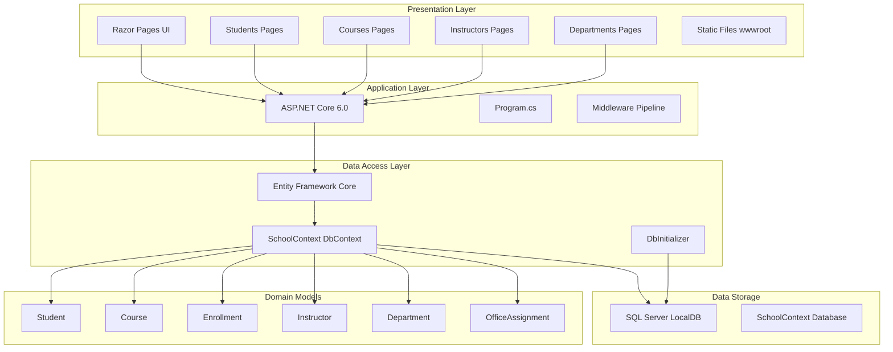
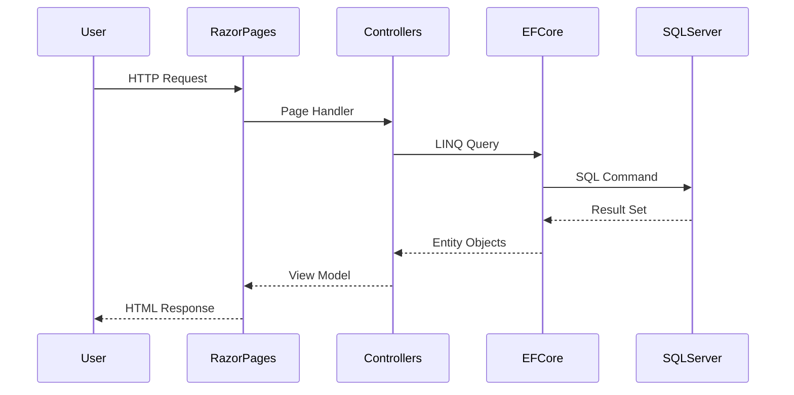

# ContosoUniversity Architecture Diagram

## Application Overview

**Application Name:** ContosoUniversity  
**Type:** ASP.NET Core 6.0 Web Application  
**Framework:** Razor Pages  
**Assessment Date:** 2026-02-07  

## Architecture Diagram

## Technology Stack

### Frontend
- **UI Framework:** ASP.NET Core Razor Pages
- **CSS Framework:** Bootstrap 5.x
- **JavaScript:** jQuery with validation plugins

### Backend
- **Runtime:** .NET 6.0
- **Web Framework:** ASP.NET Core 6.0
- **ORM:** Entity Framework Core 6.0.2
- **Database Provider:** Microsoft.EntityFrameworkCore.SqlServer 6.0.2

### Database
- **Type:** SQL Server
- **Instance:** LocalDB (mssqllocaldb)
- **Database:** SchoolContext
- **Connection Management:** Connection strings in appsettings.json

### Development Tools
- **Code Generation:** Microsoft.VisualStudio.Web.CodeGeneration.Design 6.0.2
- **Diagnostics:** Microsoft.AspNetCore.Diagnostics.EntityFrameworkCore 6.0.2
- **Migrations:** Entity Framework Core Migrations

## Application Structure

### Domain Entities
1. **Student** - Student information and enrollments
2. **Course** - Course catalog and details
3. **Enrollment** - Student course registrations with grades
4. **Instructor** - Instructor information and course assignments
5. **Department** - Academic departments
6. **OfficeAssignment** - Instructor office locations

### Relationships
- Students have many Enrollments
- Courses have many Enrollments
- Instructors teach many Courses (many-to-many)
- Courses belong to Departments
- Instructors have one OfficeAssignment

### Key Pages
- **Students:** CRUD operations for student management
- **Courses:** Course management with department association
- **Instructors:** Instructor management with course assignments
- **Departments:** Department administration
- **About:** Student statistics by enrollment date

## Data Flow

## Configuration

### Connection Strings
- **SchoolContext:** SQL Server LocalDB connection with MultipleActiveResultSets enabled

### Application Settings
- **PageSize:** 3 (pagination)
- **Logging:** Information level for application, Warning for ASP.NET Core
- **AllowedHosts:** * (all hosts allowed)

## Migration Readiness

### Assessment Summary
- **Total Issues:** 2
- **Severity Breakdown:**
  - Mandatory: 0
  - Optional: 1 (Static files - consider CDN for scale)
  - Potential: 1 (Connection strings - requires Azure SQL configuration)
  - Information: 0

### Key Migration Considerations
1. **Static Files (Scale.0001):** 33 static files in wwwroot should be served from CDN for better scalability
2. **Connection Strings (Connection.0001):** SQL Server LocalDB connection needs migration to Azure SQL Database

## Architecture Patterns

### Current Patterns
- **Repository Pattern:** Via Entity Framework Core DbContext
- **Code-First Migrations:** Database schema managed through EF Core migrations
- **Dependency Injection:** Built-in ASP.NET Core DI container
- **Configuration Management:** appsettings.json with environment overrides
- **Database Initialization:** Automatic migration and seed data on startup

### Design Characteristics
- **Layered Architecture:** Clear separation between presentation, business logic, and data access
- **Convention over Configuration:** Follows ASP.NET Core Razor Pages conventions
- **ORM-Based Data Access:** Entity Framework Core for database operations
- **Stateless Web Tier:** No session state, suitable for cloud deployment
