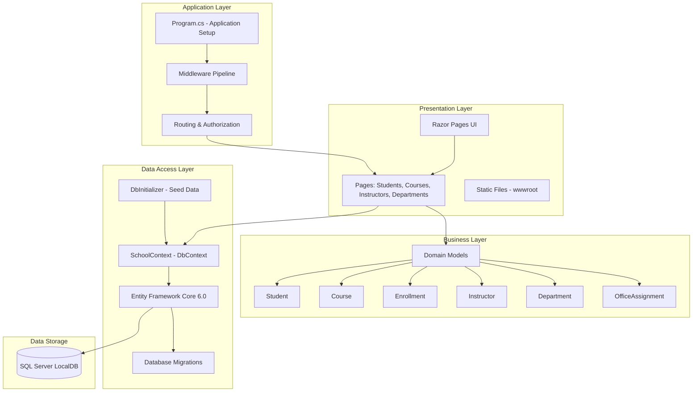

# ContosoUniversity - Architecture Diagram

## Overview

This diagram represents the architecture of the ContosoUniversity application, a .NET 6.0 ASP.NET Core web application using Razor Pages and Entity Framework Core.

## Application Architecture

## Technology Stack

| Layer | Technology |
|-------|------------|
| **Framework** | ASP.NET Core 6.0 |
| **UI** | Razor Pages |
| **ORM** | Entity Framework Core 6.0.2 |
| **Database** | SQL Server (LocalDB) |
| **Language** | C# with Implicit Usings |
| **Authentication** | ASP.NET Core Identity (via Authorization middleware) |

## Key Components

### Presentation Layer
- **Razor Pages**: Page-based web UI framework
- **Pages**: Students, Courses, Instructors, Departments, About
- **Static Files**: CSS, JavaScript, images in wwwroot

### Application Layer
- **Program.cs**: Application configuration and middleware pipeline
- **Middleware**: HTTPS Redirection, Static Files, Routing, Authorization
- **Development Tools**: Developer Exception Page, Migrations Endpoint

### Business Layer
- **Domain Models**:
  - Student: Represents students enrolled in the university
  - Course: Represents courses offered by departments
  - Enrollment: Links students to courses with grades
  - Instructor: Represents university instructors
  - Department: Represents academic departments
  - OfficeAssignment: Maps instructors to office locations

### Data Access Layer
- **SchoolContext**: EF Core DbContext managing all entities
- **DbInitializer**: Seeds initial data on application startup
- **Migrations**: Database schema versioning and updates
- **Entity Framework Core**: ORM for data access with LINQ queries

### Data Storage
- **SQL Server LocalDB**: Development database
- **Connection String**: Configured in appsettings.json
- **Features**: Trusted Connection, Multiple Active Result Sets

## Data Flow

1. **User Request** → Razor Page receives HTTP request
2. **Page Handler** → Processes request and interacts with SchoolContext
3. **EF Core** → Translates LINQ queries to SQL
4. **Database** → Executes queries and returns data
5. **Entity Mapping** → EF Core maps results to domain models
6. **Page Rendering** → Razor Page renders HTML response
7. **HTTP Response** → Browser displays the page

## Database Schema

The application manages the following entities:

- **Students**: Student information and enrollment history
- **Courses**: Course catalog with credits and departments
- **Enrollments**: Student-Course relationships with grades
- **Instructors**: Faculty information
- **Departments**: Academic departments with budgets
- **OfficeAssignments**: Instructor office locations

Relationships:
- Students ↔ Enrollments ↔ Courses (Many-to-Many through Enrollments)
- Instructors ↔ Courses (Many-to-Many)
- Departments → Courses (One-to-Many)
- Instructors → OfficeAssignments (One-to-One)

## Assessment Summary

**Total Issues Found**: 2
- **Optional**: 1 (Scale category)
- **Potential**: 1 (Connection category)

**Total Effort**: 6 story points

**Migration Targets**:
- Azure App Service (Windows/Linux)
- Azure Kubernetes Service (Windows/Linux)
- Azure Container Apps
- Azure App Service Container (Windows/Linux)

## Configuration

### Application Settings
- **PageSize**: 3 (for pagination)
- **Logging**: Information level (Warning for ASP.NET Core)
- **AllowedHosts**: * (all hosts allowed)

### Database Connection
- **Provider**: SQL Server
- **Server**: (localdb)\mssqllocaldb
- **Database**: SchoolContext-a8778b0f-1bfd-4d0f-a500-09390a0df97f
- **Authentication**: Trusted Connection (Windows Authentication)

## Development Features

- **Database Developer Page Exception Filter**: Enhanced error pages for EF Core
- **Migrations Endpoint**: Apply migrations via web endpoint in development
- **Automatic Migration**: Database.Migrate() on application startup
- **Seed Data**: Automatic initialization via DbInitializer

## Production Considerations

- **HSTS**: HTTP Strict Transport Security enabled (30 days)
- **HTTPS Redirection**: All traffic redirected to HTTPS
- **Exception Handling**: Custom error pages in production
- **Environment-based Configuration**: Different settings for Development/Production

---

*Generated by AppCAT Assessment - Architecture Analysis*
*Date: 2026-02-07*
*AppCAT Version: 1.0.601*
