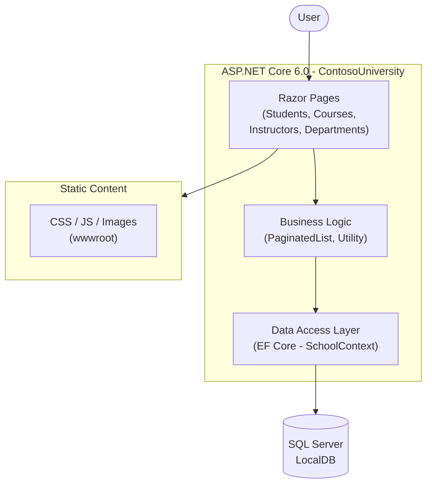

```mermaid
flowchart TD
    User([User]) --> UI

    subgraph App["ASP.NET Core 6.0 - ContosoUniversity"]
        UI["Razor Pages\n(Students, Courses,\nInstructors, Departments)"]
        BL["Business Logic\n(PaginatedList, Utility)"]
        DAL["Data Access Layer\n(EF Core - SchoolContext)"]
        UI --> BL
        BL --> DAL
    end

    DAL --> DB[(SQL Server\nLocalDB)]

    subgraph Static["Static Content"]
        CSS["CSS / JS / Images\n(wwwroot)"]
    end

    UI --> Static
```
