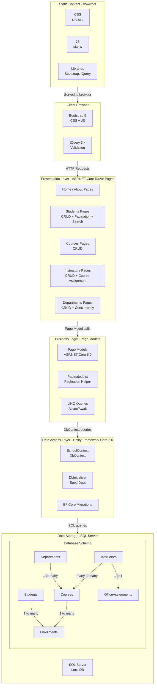

# Architecture Diagram

ContosoUniversity is an ASP.NET Core Razor Pages web application for managing a university's student enrollment system, built on .NET 6 with Entity Framework Core and SQL Server.

## Application Architecture

