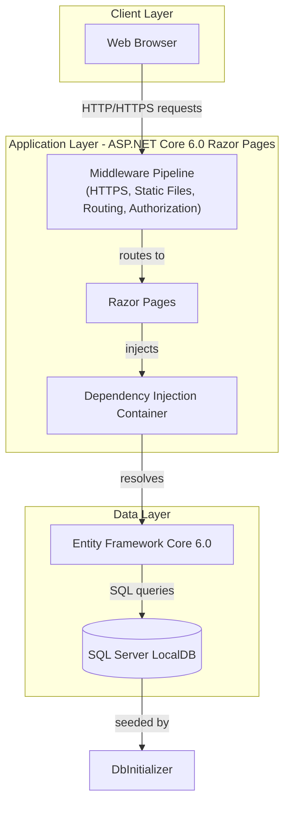
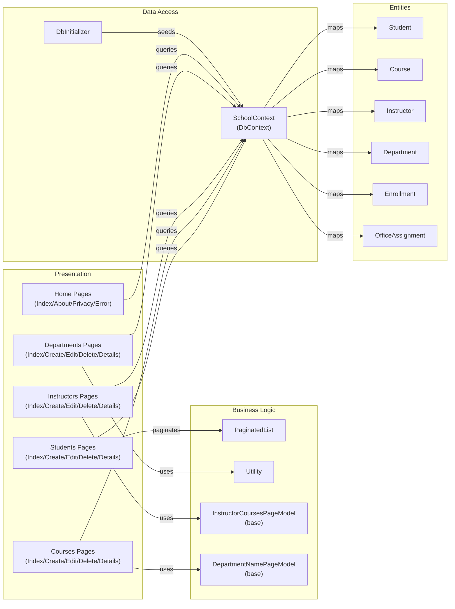

# Architecture Diagram

This is an ASP.NET Core 6.0 Razor Pages web application for managing university students, courses, instructors, and departments, backed by SQL Server via Entity Framework Core.

## Application Architecture

## Component Relationships

