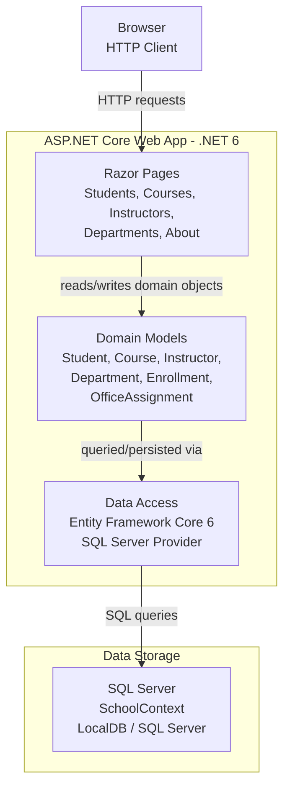

# Architecture Diagram

This diagram illustrates the high-level architecture of the Contoso University ASP.NET Core Razor Pages application.

## Application Architecture

```mermaid
flowchart TD
    Browser["Browser\nHTTP Client"]

    subgraph App["ASP.NET Core Web App - .NET 6"]
        Pages["Razor Pages\nStudents, Courses, Instructors,\nDepartments, About"]
        Models["Domain Models\nStudent, Course, Instructor,\nDepartment, Enrollment,\nOfficeAssignment"]
        EF["Data Access\nEntity Framework Core 6\nSQL Server Provider"]
    end

    subgraph Storage["Data Storage"]
        SQL["SQL Server\nSchoolContext\nLocalDB / SQL Server"]
    end

    Browser -->|"HTTP requests"| Pages
    Pages -->|"reads/writes domain objects"| Models
    Models -->|"queried/persisted via"| EF
    EF -->|"SQL queries"| SQL
```
