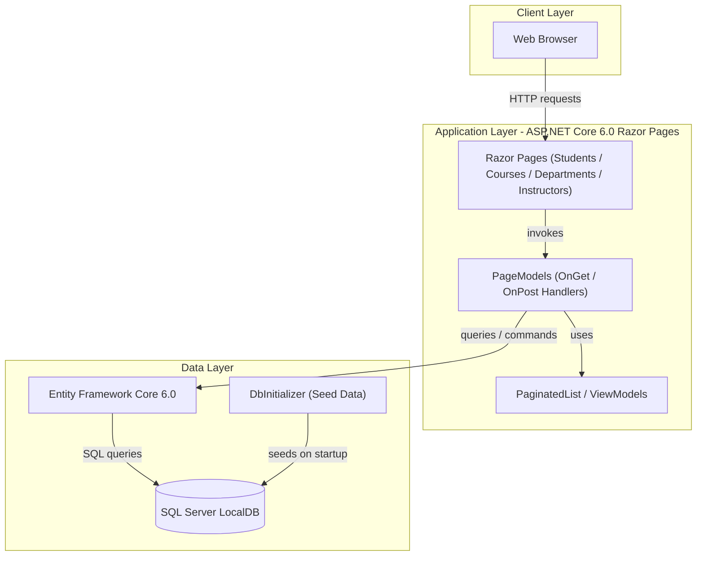
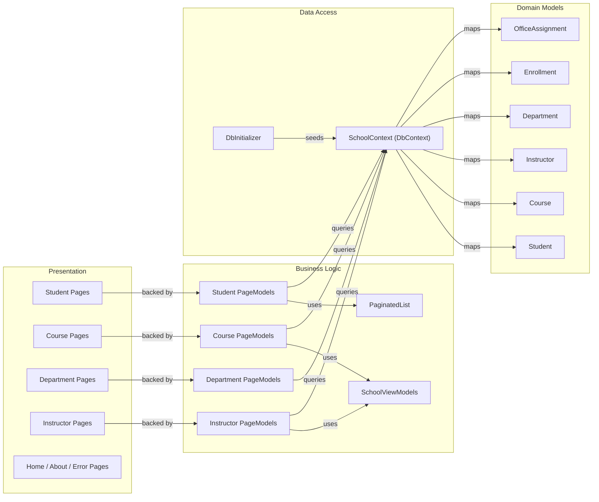

# Architecture Diagram

ContosoUniversity is an ASP.NET Core 6.0 Razor Pages web application for managing university students, courses, instructors, and departments, using Entity Framework Core with SQL Server for data persistence.

## Application Architecture

## Component Relationships

