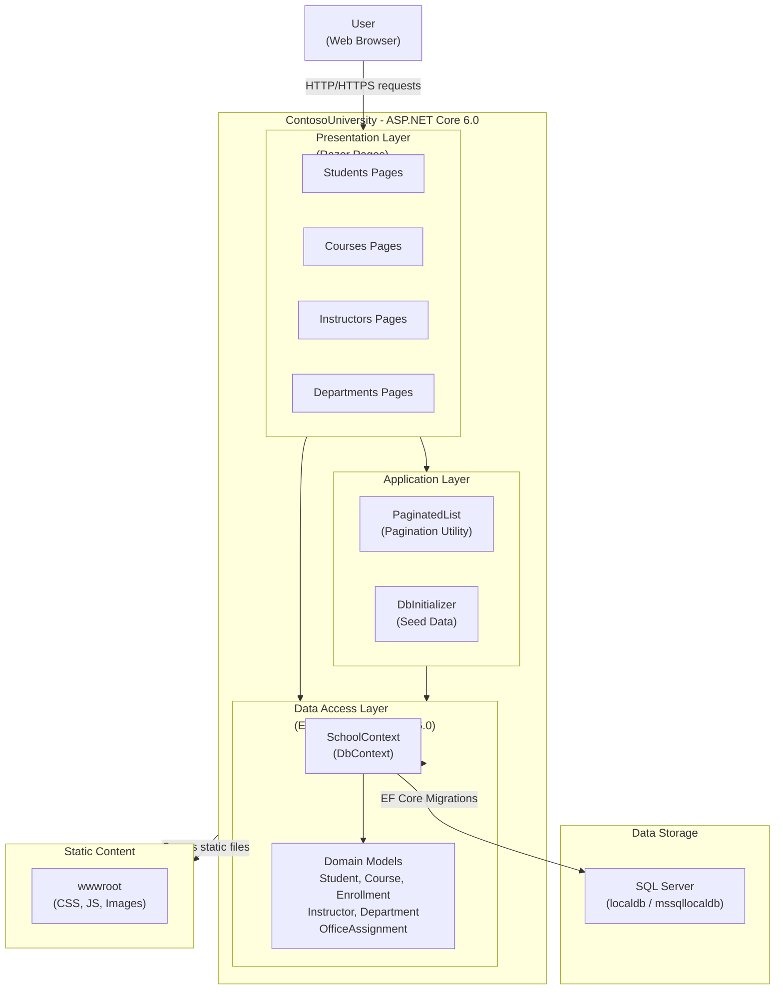

# Architecture Diagram

ContosoUniversity is an ASP.NET Core Razor Pages web application that manages university data including students, courses, instructors, and departments using Entity Framework Core with SQL Server.

## Application Architecture

