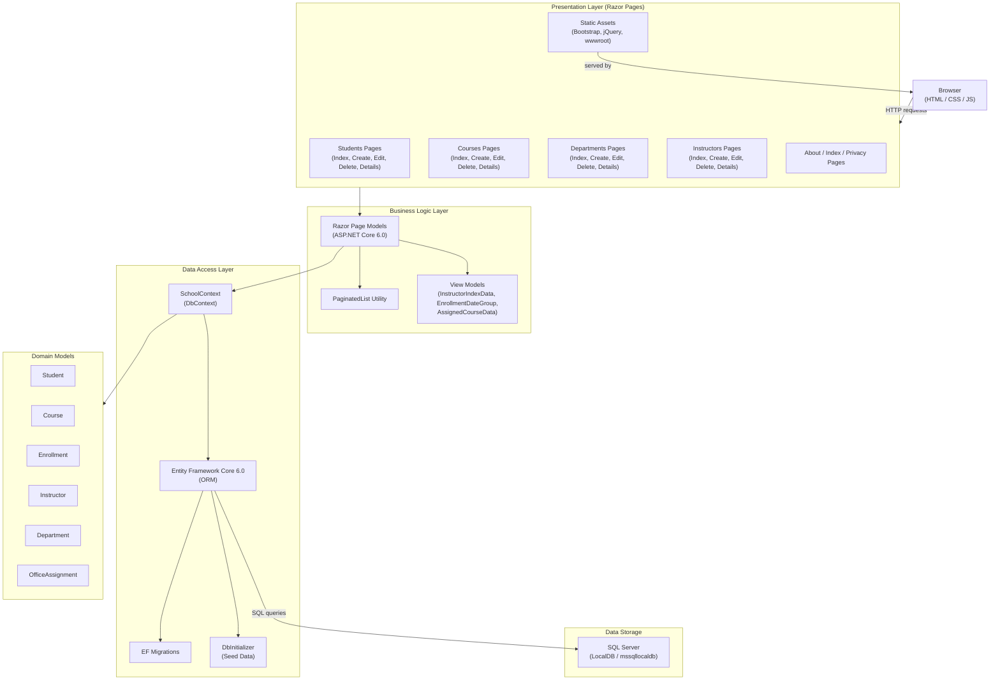

# Architecture Diagram

This diagram represents the architecture of the Contoso University ASP.NET Core web application, showing its layers, data flow, and key dependencies.

## Application Architecture

