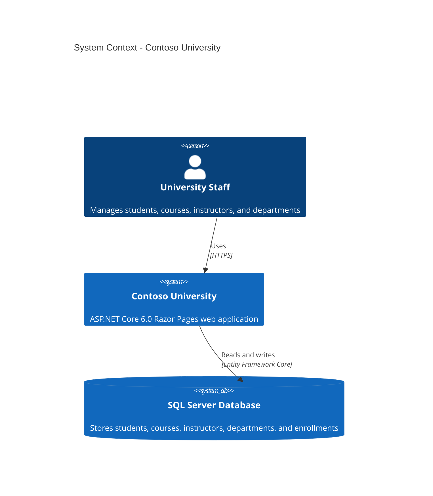
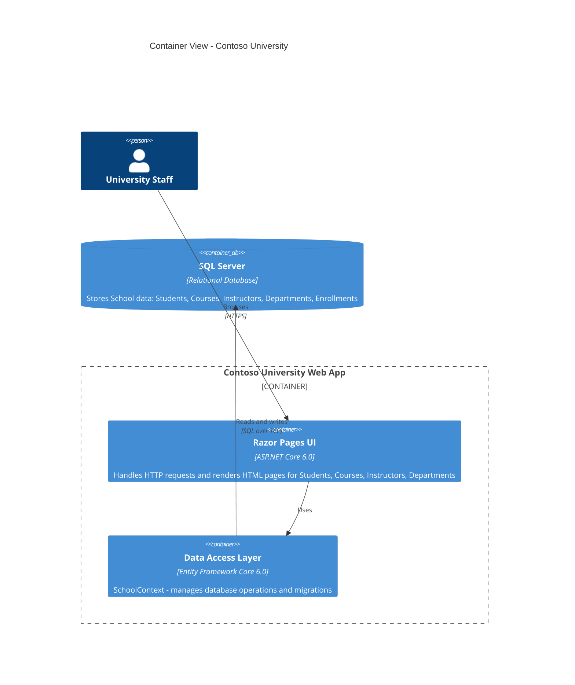
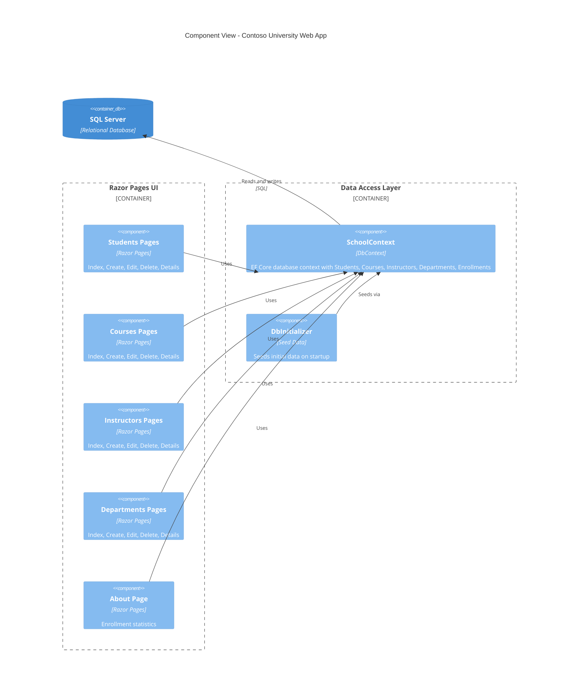

# Architecture Diagram

Contoso University is an ASP.NET Core 6.0 Razor Pages web application for managing university students, courses, instructors, and departments, backed by SQL Server via Entity Framework Core.

## System Context

This diagram shows how the Contoso University application interacts with external systems.

## Container View

This diagram shows the major containers within the application and how they communicate.

## Component View

This diagram shows the internal components of the Contoso University web application.

