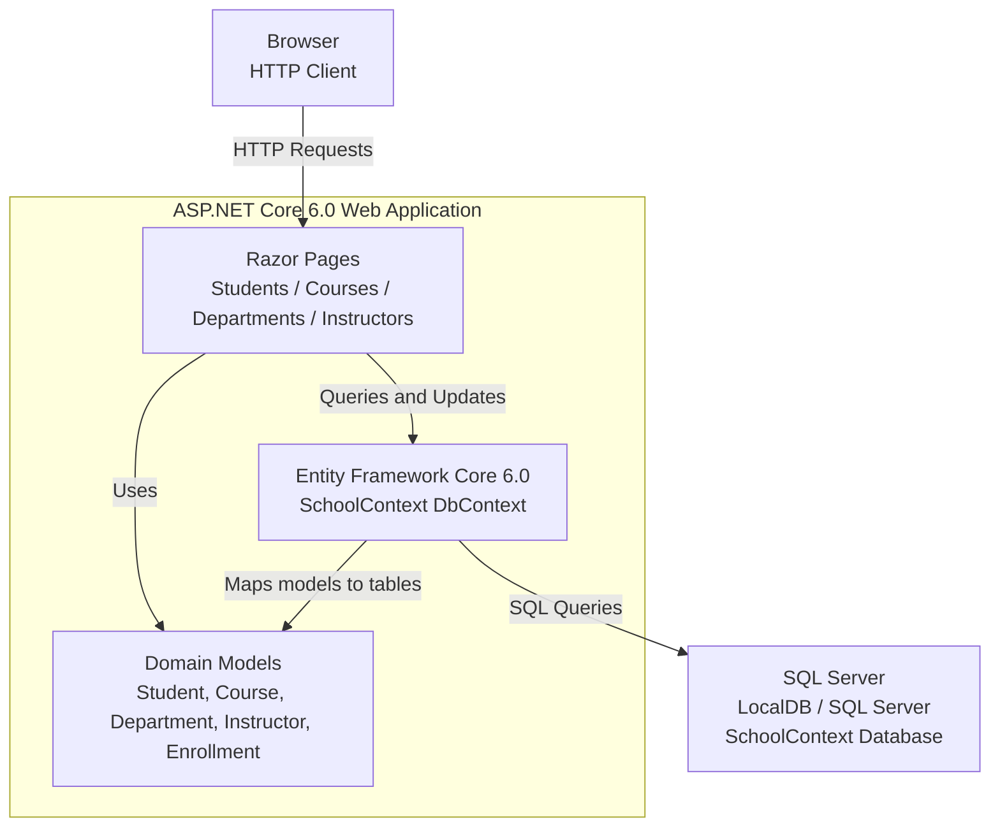

# Architecture Diagram

ContosoUniversity is an ASP.NET Core 6.0 Razor Pages web application that manages university students, courses, departments, and instructors using Entity Framework Core with SQL Server.

## Application Architecture

