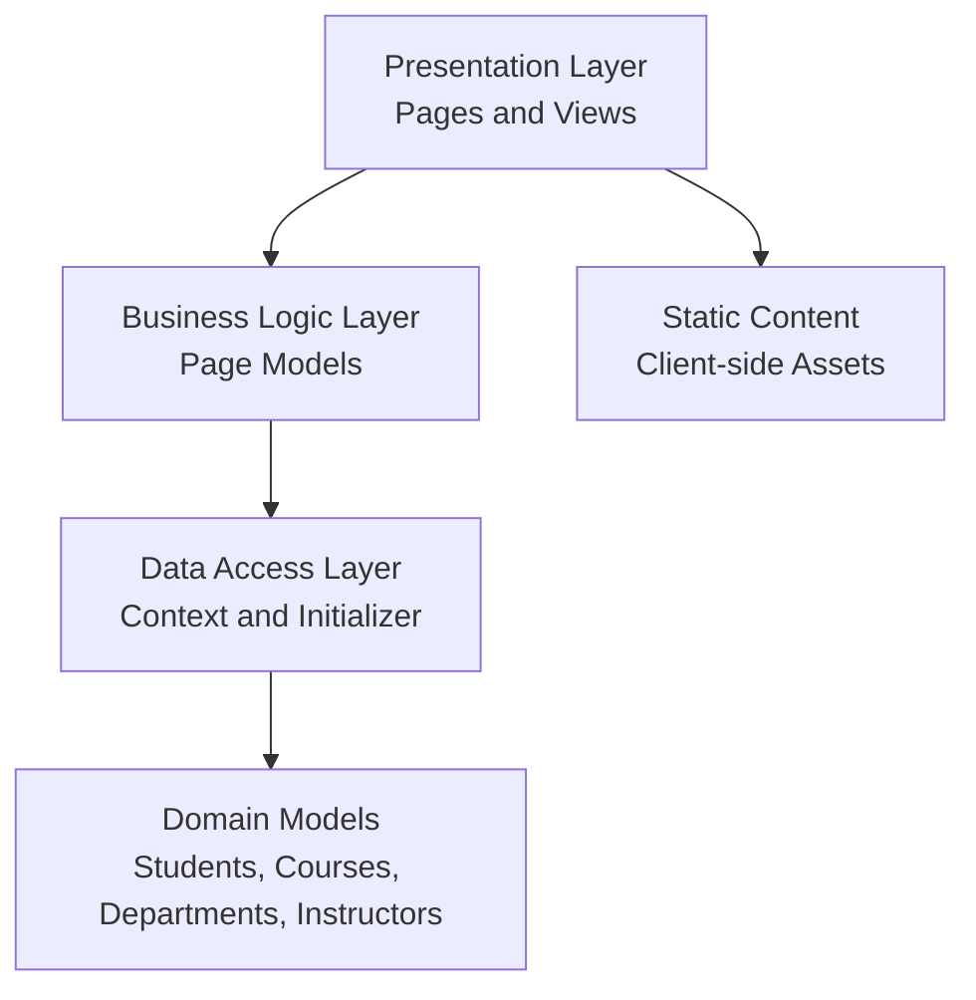

# Architecture Diagram

Application architecture showing logical layers and data flow.

## Application Architecture

This diagram illustrates the layered structure of the application and how data flows between layers.

