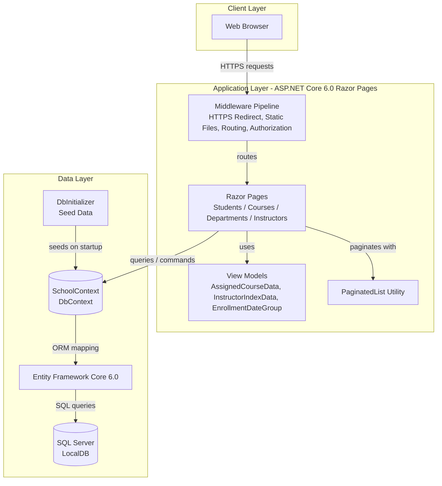
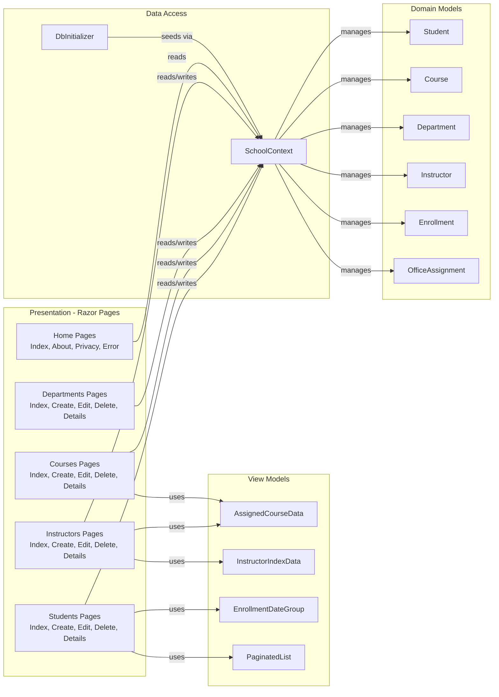

# Architecture Diagram

ContosoUniversity is an ASP.NET Core 6.0 Razor Pages web application using Entity Framework Core for data access against a SQL Server database.

## Application Architecture

## Component Relationships

