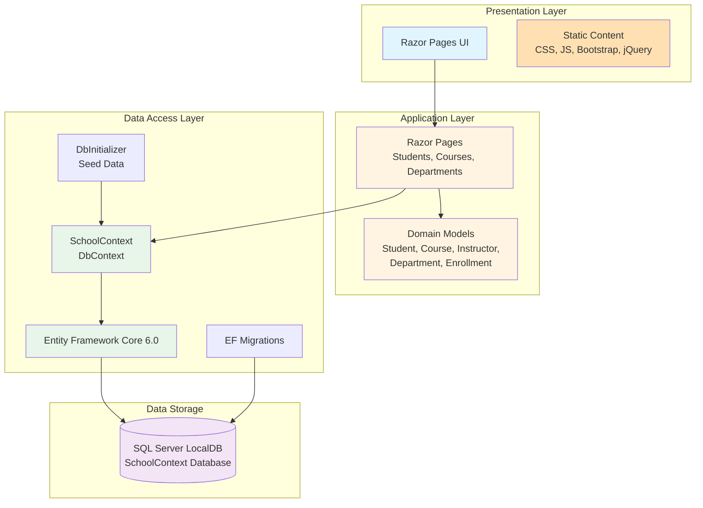

# ContosoUniversity Architecture Diagram

## Application Overview

ContosoUniversity is an ASP.NET Core 6.0 web application built using Razor Pages for managing university data including students, courses, departments, and instructors.

## Architecture Diagram

## Technology Stack

### Framework & Runtime
- **ASP.NET Core**: 6.0 (net6.0)
- **Language**: C#
- **Build Tool**: MSBuild
- **Application Type**: Web Application (Razor Pages)

### Key Dependencies
- **Microsoft.EntityFrameworkCore.SqlServer** (6.0.2): SQL Server database provider
- **Microsoft.EntityFrameworkCore.Tools** (6.0.2): EF Core tools for migrations
- **Microsoft.AspNetCore.Diagnostics.EntityFrameworkCore** (6.0.2): Database error page
- **Microsoft.VisualStudio.Web.CodeGeneration.Design** (6.0.2): Scaffolding support

### Frontend Technologies
- **Bootstrap**: CSS framework for responsive design
- **jQuery**: JavaScript library
- **jQuery Validation**: Client-side form validation
- **Static Files**: Served directly from wwwroot directory

### Data Access
- **Entity Framework Core**: ORM for database access
- **SQL Server LocalDB**: Development database
- **Database-First Migrations**: Automatic schema migration on startup

## Application Structure

### Domain Models
- **Student**: Student information and enrollments
- **Course**: Course details and enrollments
- **Instructor**: Faculty information
- **Department**: Department data and relationships
- **Enrollment**: Student-course relationship
- **OfficeAssignment**: Instructor office assignments

### Data Layer
- **SchoolContext**: EF Core DbContext managing all entity sets
- **DbInitializer**: Seeds initial test data
- **Migrations**: Database schema versioning

### Pages (Razor Pages)
- **Students**: CRUD operations for students
- **Courses**: Course management
- **Departments**: Department management
- **About**: Statistics page
- **Index**: Home page
- **Error**: Error handling page

## Assessment Findings

### Issues Identified: 2

#### 1. Static Content (Scale.0001) - Optional
- **Category**: Scale
- **Severity**: Optional
- **Effort**: 3 story points
- **Description**: 33 static files detected in wwwroot directory (CSS, JS, Bootstrap, jQuery)
- **Recommendation**: Consider moving static content to Azure Blob Storage with Azure CDN for better performance, scalability, and cost optimization

#### 2. Connection String (Connection.0001) - Potential
- **Category**: Connection
- **Severity**: Potential
- **Effort**: 3 story points
- **Location**: appsettings.json
- **Description**: SQL Server LocalDB connection string detected
- **Recommendation**: Review connection string for Azure compatibility. Consider:
  - Migrating to Azure SQL Database
  - Azure SQL Managed Instance for advanced features
  - SQL Server on Azure VMs for lift-and-shift

### Total Effort: 6 Story Points

## Data Flow

1. **User Request** → Razor Pages UI
2. **Page Handler** → Domain Models and SchoolContext
3. **Entity Framework Core** → Translates LINQ to SQL
4. **SQL Server LocalDB** → Executes queries and returns data
5. **Response** → Razor Pages render HTML with data

## Key Features

- **Automatic Database Initialization**: DbInitializer seeds test data on first run
- **Automatic Migrations**: Database schema updated on application startup
- **Developer Exception Page**: Enhanced error pages in development mode
- **HTTPS Redirection**: Secure communication enforced
- **Static File Serving**: CSS, JavaScript, and other assets served from wwwroot

## Cloud Migration Considerations

Based on the assessment, when migrating to Azure, consider:

1. **Database Migration**: 
   - Migrate from SQL Server LocalDB to Azure SQL Database or Azure SQL Managed Instance
   - Update connection strings to use Azure SQL connection
   - Configure firewall rules and networking

2. **Static Content Optimization**:
   - Move static files (Bootstrap, jQuery, CSS, JS) to Azure Blob Storage
   - Configure Azure CDN for global content delivery
   - Reduce application deployment size

3. **Target Platforms** (Assessed):
   - Azure App Service (Windows/Linux)
   - Azure Kubernetes Service (AKS)
   - Azure Container Apps (ACA)
   - Azure App Service Container
   - Azure App Service Managed Instance

## Assessment Metadata

- **Analysis Date**: 2026-02-11
- **AppCAT Version**: 1.0.878
- **Privacy Mode**: Protected
- **Total Projects**: 1
- **Target Platforms**: All Azure compute platforms (Any)
