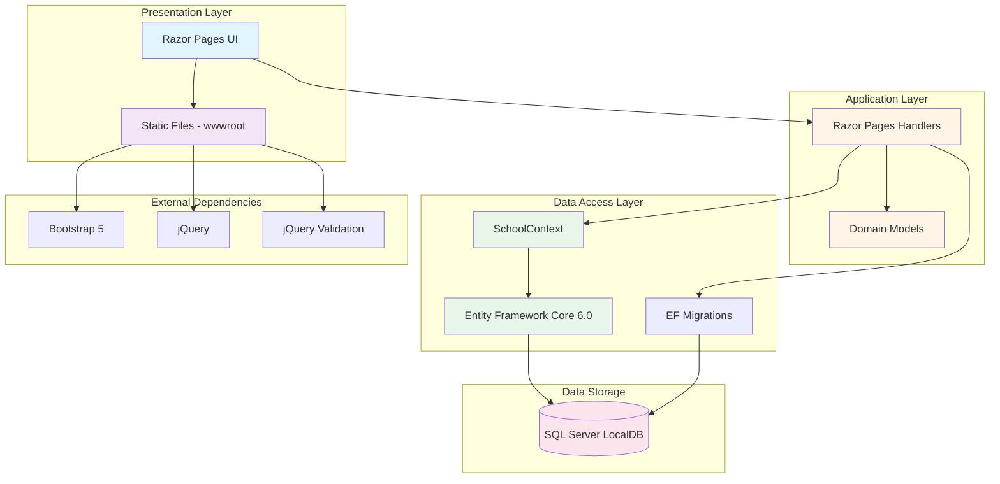

# ContosoUniversity Architecture Diagram

## Application Overview

**ContosoUniversity** is an ASP.NET Core 6.0 web application built using Razor Pages that demonstrates a simple university management system with students, courses, departments, and instructors.

## Architecture Diagram

## Technology Stack

### Framework & Runtime
- **ASP.NET Core**: 6.0 (Microsoft.NET.Sdk.Web)
- **Target Framework**: .NET 6.0
- **Language**: C#
- **Build Tool**: MSBuild

### Data Access
- **ORM**: Entity Framework Core 6.0.2
- **Database Provider**: Microsoft.EntityFrameworkCore.SqlServer 6.0.2
- **Database**: SQL Server (LocalDB)
- **Migrations**: EF Core Migrations with automatic migration on startup

### Web Framework
- **UI Framework**: Razor Pages
- **Static Files**: CSS, JavaScript, images served from wwwroot
- **Authentication**: Not implemented (basic application)
- **Authorization**: Basic ASP.NET Core Authorization middleware

### Front-end Libraries
- **CSS Framework**: Bootstrap 5
- **JavaScript Library**: jQuery
- **Validation**: jQuery Validation & Unobtrusive Validation

## Application Components

### Domain Models
- **Student**: Student information and enrollments
- **Course**: Course details and enrollments
- **Enrollment**: Student-course enrollment relationship
- **Instructor**: Instructor information
- **Department**: Department details with assigned instructors
- **OfficeAssignment**: Instructor office assignments

### Data Context
- **SchoolContext**: EF Core DbContext managing all entities and database connections

### Pages Structure
- **Students**: CRUD operations for student management
- **Courses**: CRUD operations for course management
- **Departments**: CRUD operations for department management
- **Instructors**: CRUD operations for instructor management
- **About**: Statistics and information page
- **Shared**: Common layout and navigation

## Data Flow

1. **User Request** → Razor Page
2. **Page Handler** → Access Domain Models
3. **Domain Models** → Processed via SchoolContext
4. **SchoolContext** → Entity Framework Core
5. **EF Core** → SQL Server Database
6. **Response** → Rendered Razor View with Data

## Database Connection

- **Connection String**: Configured in `appsettings.json`
- **Database Name**: SchoolContext-a8778b0f-1bfd-4d0f-a500-09390a0df97f
- **Server**: (localdb)\mssqllocaldb
- **Features**: Trusted Connection, Multiple Active Result Sets

## Assessment Findings

Based on the AppCAT assessment, the following items were identified:

### 1. Static Files (Scale.0001) - Optional
- **Issue**: 33 static files found in wwwroot directory
- **Impact**: May need CDN or blob storage for better scalability in cloud
- **Effort**: 3 story points
- **Recommendation**: Consider using Azure CDN or Azure Blob Storage for static content

### 2. Database Connection (Connection.0001) - Potential
- **Issue**: LocalDB connection string detected
- **Impact**: LocalDB not available in Azure; requires migration to Azure SQL
- **Effort**: 3 story points
- **Recommendation**: Migrate to Azure SQL Database with updated connection string

## Cloud Migration Considerations

### Recommended Azure Services
- **Compute**: Azure App Service (Windows or Linux)
- **Database**: Azure SQL Database
- **Static Content**: Azure Blob Storage + Azure CDN
- **Configuration**: Azure App Configuration or Key Vault

### Migration Effort
- **Total Issues**: 2
- **Total Story Points**: 6
- **Severity Breakdown**:
  - Mandatory: 0
  - Optional: 1 (Static files)
  - Potential: 1 (Database connection)
  - Information: 0

---

*Generated from AppCAT assessment on 2026-02-11*
