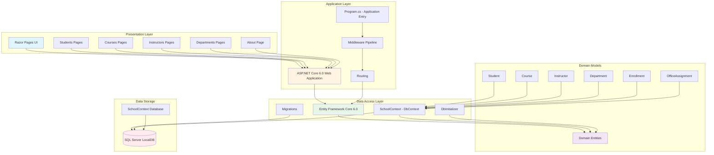

# ContosoUniversity Architecture Diagram

## Application Overview

ContosoUniversity is an ASP.NET Core 6.0 web application built using Razor Pages that manages university data including students, courses, departments, and instructors.

## Architecture Diagram

## Technology Stack

### Frontend
- **Framework**: ASP.NET Core Razor Pages
- **Static Files**: wwwroot directory
- **View Engine**: Razor (.cshtml)

### Backend
- **Runtime**: .NET 6.0
- **Framework**: ASP.NET Core 6.0 Web SDK
- **Architecture Pattern**: Razor Pages with Entity Framework Core

### Data Access
- **ORM**: Entity Framework Core 6.0.2
- **Provider**: Microsoft.EntityFrameworkCore.SqlServer
- **Migration Tool**: EF Core Migrations

### Database
- **Database**: SQL Server LocalDB
- **Connection**: Trusted Connection with MultipleActiveResultSets
- **Database Name**: SchoolContext-a8778b0f-1bfd-4d0f-a500-09390a0df97f

### Development Tools
- **Code Generation**: Microsoft.VisualStudio.Web.CodeGeneration.Design 6.0.2
- **Diagnostics**: Microsoft.AspNetCore.Diagnostics.EntityFrameworkCore 6.0.2

## Application Features

### Core Entities
1. **Student** - Manages student information
2. **Course** - Course catalog and details
3. **Instructor** - Faculty and instructor data
4. **Department** - Academic departments
5. **Enrollment** - Student course enrollments
6. **OfficeAssignment** - Instructor office assignments

### Key Functionality
- CRUD operations for Students, Courses, Instructors, and Departments
- Enrollment management
- Database seeding through DbInitializer
- Automatic database migration on application startup
- Pagination support (PageSize: 3)

## Data Flow

1. **User Request** → Razor Pages (UI Layer)
2. **Page Model** → Entity Framework Core (Data Access)
3. **DbContext** → SQL Server LocalDB (Database)
4. **Response** → Razor View → User

## Configuration

- **Logging**: Configured for Information level (Microsoft.AspNetCore at Warning)
- **HTTPS**: Enabled with redirection
- **Static Files**: Enabled for wwwroot
- **Development Mode**: 
  - Developer exception page
  - Migrations endpoint
  - Database developer page exception filter
- **Production Mode**:
  - Exception handler at /Error
  - HSTS enabled

## Architecture Characteristics

- **Pattern**: Three-tier architecture (Presentation, Business/Data Access, Database)
- **Data Access**: Repository pattern via Entity Framework Core
- **UI Pattern**: Razor Pages (Page-based MVC variant)
- **Configuration**: appsettings.json with environment-specific overrides
- **Database Strategy**: Code-first with migrations
