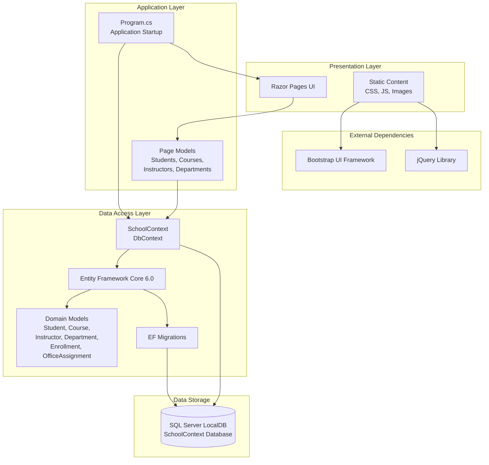

# ContosoUniversity Application Architecture

## Overview

This diagram represents the architecture of the ContosoUniversity application, a web-based university management system built with ASP.NET Core 6.0.

## Architecture Diagram

## Technology Stack

### Framework & Runtime
- **ASP.NET Core 6.0**: Web application framework
- **.NET 6.0**: Target framework
- **Razor Pages**: UI framework for building web pages

### Data Access
- **Entity Framework Core 6.0**: ORM for database operations
- **SQL Server**: Database engine (LocalDB for development)
- **EF Migrations**: Database schema versioning

### UI Libraries
- **Bootstrap**: CSS framework for responsive design
- **jQuery**: JavaScript library
- **jQuery Validation**: Client-side form validation

### Development Tools
- **Visual Studio Code Generation**: Scaffolding support
- **Entity Framework Diagnostics**: Development-time error handling

## Application Components

### Domain Models
- **Student**: Student entity with enrollments
- **Course**: Course entity with departments and instructors
- **Instructor**: Instructor entity with courses and office assignments
- **Department**: Department entity managing courses
- **Enrollment**: Many-to-many relationship between students and courses
- **OfficeAssignment**: One-to-one relationship with instructors

### Data Context
- **SchoolContext**: Central DbContext managing all entities and relationships
- **DbInitializer**: Seeds initial data for development/testing

### Pages Structure
- **Students**: CRUD operations for student management
- **Courses**: CRUD operations for course management
- **Instructors**: CRUD operations for instructor management
- **Departments**: CRUD operations for department management
- **About**: Statistics and reporting page

## Database Configuration

- **Connection String**: Configured in `appsettings.json`
- **Database**: SQL Server LocalDB (development)
- **Database Name**: SchoolContext-a8778b0f-1bfd-4d0f-a500-09390a0df97f
- **Features**: Trusted connection, multiple active result sets

## Assessment Findings

Based on the AppCAT assessment, the following considerations were identified:

### 1. Static Content (Scale.0001 - Optional)
- **Current State**: Static content (CSS, JS, images) served directly from the application
- **Consideration**: For cloud deployment, consider Azure Blob Storage + Azure CDN for better performance and cost optimization
- **Effort**: 3 story points

### 2. Connection String (Connection.0001 - Potential)
- **Current State**: Uses SQL Server LocalDB with local connection string
- **Consideration**: Database migration required for Azure deployment
- **Options**:
  - Azure SQL Database (recommended for PaaS benefits)
  - Azure SQL Managed Instance (for features not in SQL Database)
  - SQL Server on Azure VMs (IaaS approach)
- **Effort**: 3 story points

## Migration Considerations

When migrating to Azure, consider the following:

1. **Database Migration**: LocalDB connection string needs updating for Azure SQL Database
2. **Static Content**: Optionally move to Azure Blob Storage with CDN for better scalability
3. **Configuration**: Update connection strings and application settings for Azure environment
4. **Authentication**: Currently no authentication; may need Azure AD integration for production
5. **Monitoring**: Add Application Insights for telemetry and diagnostics

## Architecture Patterns

- **Layered Architecture**: Clear separation between presentation, business logic, and data access
- **Repository Pattern**: Entity Framework DbContext acts as repository
- **Code-First Approach**: Database schema defined through EF models and migrations
- **Dependency Injection**: Built-in ASP.NET Core DI for DbContext and services
