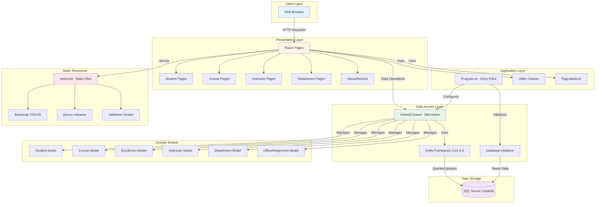

# ContosoUniversity Architecture Diagram

## Application Overview

**Application Type:** ASP.NET Core 6.0 Web Application (Razor Pages)  
**Framework:** .NET 6.0  
**Pattern:** MVC-style with Razor Pages  
**Database:** SQL Server (LocalDB)

## Architecture Diagram

## Technology Stack

### Frontend
- **UI Framework:** ASP.NET Core Razor Pages
- **CSS Framework:** Bootstrap 5.x
- **JavaScript Libraries:** 
  - jQuery 3.x
  - jQuery Validation
  - jQuery Validation Unobtrusive

### Backend
- **Runtime:** .NET 6.0
- **Web Framework:** ASP.NET Core 6.0 (Microsoft.NET.Sdk.Web)
- **ORM:** Entity Framework Core 6.0.2
- **Database Provider:** Microsoft.EntityFrameworkCore.SqlServer 6.0.2

### Data Storage
- **Database:** SQL Server (LocalDB)
- **Connection:** Trusted Connection with MultipleActiveResultSets
- **Database Name:** SchoolContext

### Development Tools
- **EF Core Tools:** Microsoft.EntityFrameworkCore.Tools 6.0.2
- **Diagnostics:** Microsoft.AspNetCore.Diagnostics.EntityFrameworkCore 6.0.2
- **Code Generation:** Microsoft.VisualStudio.Web.CodeGeneration.Design 6.0.2

## Application Structure

### Data Layer
- **SchoolContext.cs**: Main DbContext managing all entities
- **DbInitializer.cs**: Database seeding and initialization logic
- **Migrations**: EF Core database migrations for schema management

### Domain Models
The application manages a university domain with the following entities:
- **Student**: Student information and enrollments
- **Course**: Course catalog and details
- **Enrollment**: Student-Course enrollment relationship
- **Instructor**: Instructor information and course assignments
- **Department**: Department structure and management
- **OfficeAssignment**: Instructor office assignments

### Presentation Layer
Razor Pages organized by feature:
- **Students/**: Student CRUD operations
- **Courses/**: Course management
- **Instructors/**: Instructor management
- **Departments/**: Department administration
- **About.cshtml**: Analytics and reporting
- **Index.cshtml**: Home page
- **Shared/**: Shared layouts and components

### Utility Classes
- **PaginatedList.cs**: Generic pagination support
- **Utility.cs**: Common helper functions
- **SchoolViewModels**: View models for complex queries

## Key Patterns and Practices

1. **Repository Pattern**: Implemented through EF Core DbContext
2. **Pagination**: Custom PaginatedList for large datasets
3. **Code-First Migrations**: EF Core migrations for database schema
4. **Dependency Injection**: Built-in ASP.NET Core DI container
5. **Configuration Management**: appsettings.json for configuration
6. **Static File Serving**: wwwroot directory for client-side assets

## Database Schema

The application uses Entity Framework Core with the following main tables:
- Course
- Student  
- Instructor
- Enrollment (junction table)
- Department
- OfficeAssignment

Relationships include:
- Many-to-Many: Students ↔ Courses (through Enrollments)
- Many-to-Many: Instructors ↔ Courses
- One-to-One: Instructor ↔ OfficeAssignment
- One-to-Many: Department ↔ Courses

## Assessment Findings

Based on AppCAT analysis (2 issues discovered):

1. **Static Content Management** (Optional - 3 story points)
   - 33 static files in wwwroot detected
   - Consider using Azure CDN or Azure Storage for static content in production
   
2. **Connection String Configuration** (Potential issue)
   - LocalDB connection string detected
   - Needs migration to Azure SQL Database for cloud deployment

## Cloud Migration Considerations

For Azure migration, consider:
- Migrate from LocalDB to Azure SQL Database
- Move static assets (CSS, JS) to Azure CDN or Storage
- Configure connection strings using Azure Key Vault
- Enable Application Insights for monitoring
- Consider Azure App Service for hosting
