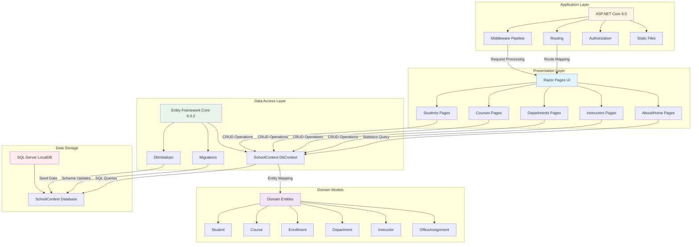

# ContosoUniversity Architecture Diagram

## Application Overview

**Application Type**: ASP.NET Core 6.0 Razor Pages Web Application  
**Target Framework**: .NET 6.0  
**Architecture Pattern**: 3-Tier Web Application

## Architecture Diagram

## Technology Stack

### Web Framework
- **ASP.NET Core**: 6.0
- **UI Technology**: Razor Pages
- **Authentication**: Built-in ASP.NET Core Authorization

### Data Access
- **ORM**: Entity Framework Core 6.0.2
- **Database Provider**: Microsoft.EntityFrameworkCore.SqlServer 6.0.2
- **Migrations**: Entity Framework Core Migrations

### Database
- **Database Engine**: SQL Server (LocalDB)
- **Connection**: Trusted Connection with MultipleActiveResultSets

### Development Tools
- **Diagnostics**: Microsoft.AspNetCore.Diagnostics.EntityFrameworkCore 6.0.2
- **Code Generation**: Microsoft.VisualStudio.Web.CodeGeneration.Design 6.0.2

## Application Components

### Presentation Layer (Razor Pages)
- **Students**: Create, Read, Update, Delete (CRUD) operations for students
- **Courses**: Manage courses and course assignments
- **Departments**: Department management
- **Instructors**: Instructor information and assignments
- **About**: Statistics and enrollment data visualization
- **Static Content**: CSS, JavaScript, images served via wwwroot

### Business Logic
- Embedded in Razor Page Models (PageModel classes)
- PaginatedList utility for pagination support
- DbInitializer for data seeding

### Data Access Layer
- **SchoolContext**: Main DbContext with DbSets for all entities
- **Entity Relationships**:
  - Students enrolled in Courses (via Enrollment)
  - Courses belong to Departments
  - Instructors assigned to Courses (many-to-many)
  - Instructors have OfficeAssignments (one-to-one)

### Domain Models
- **Student**: Student information and enrollments
- **Course**: Course details with credits and department
- **Enrollment**: Student enrollment in courses with grades
- **Department**: Academic departments with budget
- **Instructor**: Instructor details and hire date
- **OfficeAssignment**: Office location for instructors

## Configuration

### Application Settings
- **PageSize**: 3 (pagination)
- **Logging**: Information level for default, Warning for ASP.NET Core
- **AllowedHosts**: * (all hosts)

### Connection Strings
- **SchoolContext**: SQL Server LocalDB connection with trusted authentication

## Data Flow

1. **User Request**: Browser sends HTTP request to ASP.NET Core application
2. **Routing**: Middleware pipeline routes request to appropriate Razor Page
3. **Page Processing**: PageModel processes request, interacts with SchoolContext
4. **Data Access**: Entity Framework Core translates LINQ queries to SQL
5. **Database Query**: SQL Server executes queries and returns results
6. **Entity Mapping**: EF Core maps results to domain entities
7. **Response Rendering**: Razor Page renders HTML with data
8. **HTTP Response**: Response sent back to browser

## Assessment Findings

Based on the AppCAT assessment report:

- **Issues Found**: 2
- **Incidents**: 2
- **Story Points**: 6
- **Severity**:
  - Optional: 1 issue
  - Potential: 1 issue
- **Categories**:
  - Scale: 1 issue
  - Connection: 1 issue

These issues are related to cloud migration readiness and may require attention when modernizing to Azure.
