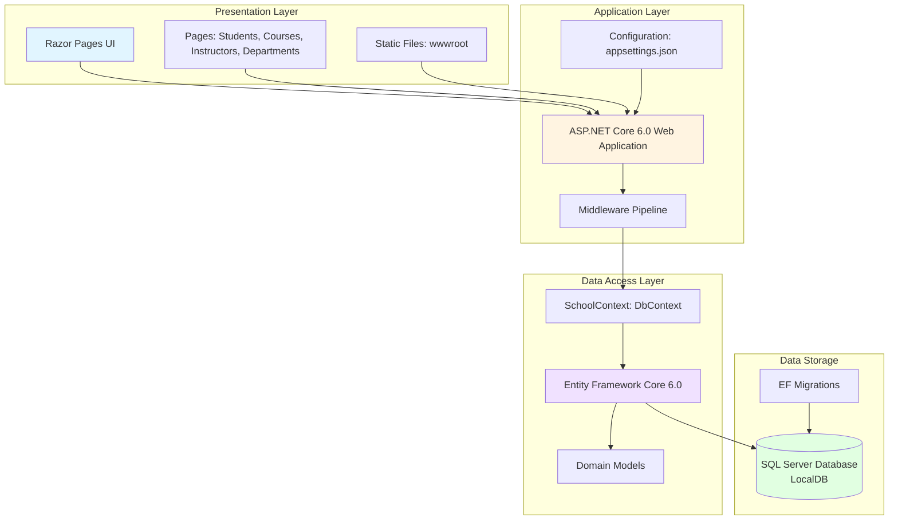

# ContosoUniversity Application Architecture

This diagram visualizes the high-level architecture of the ContosoUniversity application based on the codebase analysis.

## Architecture Overview

## Technology Stack

### Framework & Runtime
- **ASP.NET Core 6.0** - Web application framework
- **.NET 6.0** - Runtime platform
- **Razor Pages** - UI rendering engine

### Data Access
- **Entity Framework Core 6.0** - ORM framework
- **Microsoft.EntityFrameworkCore.SqlServer** - SQL Server provider
- **EF Core Migrations** - Database schema management

### Database
- **SQL Server LocalDB** - Development database
- **Connection String**: Server=(localdb)\\mssqllocaldb

### Development Tools
- **Microsoft.EntityFrameworkCore.Tools** - EF Core CLI tools
- **Microsoft.VisualStudio.Web.CodeGeneration.Design** - Code scaffolding
- **Microsoft.AspNetCore.Diagnostics.EntityFrameworkCore** - Database error page

## Application Components

### Domain Models
- **Student** - Student entity with enrollments
- **Course** - Course entity with instructors
- **Instructor** - Instructor entity with courses and office assignments
- **Enrollment** - Student-Course relationship with grades
- **Department** - Academic department entity
- **OfficeAssignment** - Instructor office location

### Data Access
- **SchoolContext** - Main database context managing all entities
- **DbInitializer** - Database seeding and initialization

### User Interface
- Razor Pages for CRUD operations
- Static file serving (CSS, JavaScript, images)
- Responsive web interface

## Data Flow

1. **User Request** → Razor Pages handle HTTP requests
2. **Page Model** → Business logic and data access through SchoolContext
3. **Entity Framework** → Translates LINQ queries to SQL
4. **SQL Server** → Executes queries and returns results
5. **Response** → Data rendered in Razor views and returned to user

## Key Architectural Patterns

- **Layered Architecture**: Clear separation between presentation, application, and data layers
- **Repository Pattern**: Entity Framework DbContext acts as repository
- **Dependency Injection**: Services registered and injected via ASP.NET Core DI
- **Code-First Migrations**: Database schema managed through EF Core migrations
- **Convention over Configuration**: Minimal configuration with ASP.NET Core defaults

## Assessment Insights

Based on the AppCAT assessment:
- **Issues Discovered**: 2
- **Story Points**: 6
- **Complexity**: Low to Medium
- **Migration Readiness**: Good candidate for cloud migration

The application follows standard .NET patterns and uses modern frameworks (ASP.NET Core 6.0, EF Core 6.0), making it well-suited for migration to cloud platforms like Azure.
