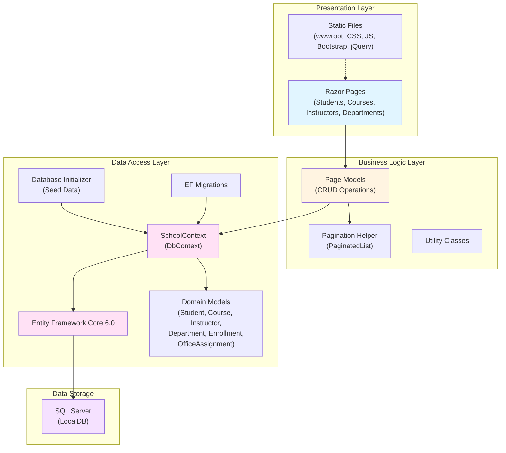

# ContosoUniversity Architecture Diagram

## Application Overview

**Application Name**: ContosoUniversity  
**Type**: ASP.NET Core Razor Pages Web Application  
**Framework**: .NET 6.0  
**Architecture Pattern**: Layered Architecture (Presentation, Business Logic, Data Access)

## Architecture Diagram

## Technology Stack

### Presentation Layer
- **UI Framework**: ASP.NET Core Razor Pages
- **Frontend Libraries**: 
  - Bootstrap 5.x (CSS framework)
  - jQuery 3.x
  - jQuery Validation

### Business Logic
- **Language**: C# (.NET 6.0)
- **Framework**: ASP.NET Core 6.0
- **Features**:
  - Pagination support
  - Model validation
  - Dependency injection

### Data Access
- **ORM**: Entity Framework Core 6.0
- **Provider**: Microsoft.EntityFrameworkCore.SqlServer
- **Migration Tool**: EF Core Migrations
- **Development Tools**: Database Developer Page Exception Filter

### Data Storage
- **Database**: SQL Server (LocalDB for development)
- **Connection**: Trusted connection with Multiple Active Result Sets

## Domain Model

The application manages a university database with the following entities:

1. **Student**: Student information and enrollment data
2. **Course**: Course catalog and details
3. **Instructor**: Faculty information
4. **Department**: Academic departments
5. **Enrollment**: Student course enrollments (junction table)
6. **OfficeAssignment**: Instructor office assignments

## Key Features

- Student management (Create, Read, Update, Delete)
- Course management
- Instructor management
- Department management
- Automatic database initialization with seed data
- Database migration on application startup
- Pagination for list views
- Developer-friendly error pages in development mode

## Application Configuration

- **Configuration Files**: appsettings.json, appsettings.Development.json
- **Connection String**: Configured for LocalDB
- **Page Size**: Configurable (default: 3)
- **Security**: HTTPS redirection, HSTS enabled in production

## Assessment Findings

Based on the AppCAT assessment report:

- **Total Issues**: 2
- **Total Incidents**: 2
- **Total Story Points**: 6
- **Issue Categories**:
  - **Scale.0001** (Optional): Static files in wwwroot - Consider using CDN or Azure Storage for static content in cloud deployments
  - **Connection.0001** (Potential): Connection string configuration - Review for cloud migration best practices

## Deployment Targets

The application is compatible with multiple Azure deployment targets:
- Azure App Service (Windows/Linux)
- Azure Kubernetes Service (AKS)
- Azure Container Apps (ACA)
- Azure App Service Container

## Notes

- Application uses localdb connection string suitable for local development
- Database is automatically migrated and initialized on startup
- Static content (CSS, JS libraries) is served from wwwroot directory
- Application follows standard ASP.NET Core Razor Pages conventions
