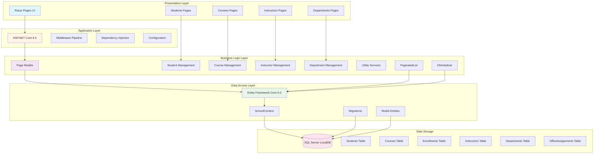

# ContosoUniversity Application Architecture

## Architecture Diagram

## Technology Stack

### Framework & Runtime
- **ASP.NET Core 6.0** - Web application framework
- **.NET 6.0** - Runtime platform
- **Razor Pages** - UI framework with server-side rendering

### Data Access
- **Entity Framework Core 6.0** - ORM for data access
  - Microsoft.EntityFrameworkCore.SqlServer (6.0.2)
  - Microsoft.EntityFrameworkCore.Tools (6.0.2)

### Database
- **SQL Server LocalDB** - Development database
- **Connection**: LocalDB with trusted authentication
- **Features**: Multiple active result sets enabled

### Development Tools
- **Microsoft.AspNetCore.Diagnostics.EntityFrameworkCore** (6.0.2) - Developer exception page for EF Core
- **Microsoft.VisualStudio.Web.CodeGeneration.Design** (6.0.2) - Code scaffolding

## Application Structure

### Domain Model
The application manages an educational institution with the following entities:
- **Student** - Student information and enrollments
- **Course** - Course catalog and details
- **Enrollment** - Student course registrations
- **Instructor** - Faculty information
- **Department** - Academic departments
- **OfficeAssignment** - Instructor office locations

### Key Features
1. **Student Management** - Create, read, update, delete student records
2. **Course Management** - Manage course catalog and assignments
3. **Instructor Management** - Faculty directory and course assignments
4. **Department Management** - Academic department organization
5. **Enrollment Tracking** - Student-course relationships
6. **Pagination** - Custom pagination support for list views

### Data Access Patterns
- **DbContext**: SchoolContext manages all entity sets
- **Migrations**: Code-first database migrations
- **Seeding**: DbInitializer provides sample data
- **Eager Loading**: Related entity loading for performance

### Configuration
- **Connection String**: Stored in appsettings.json
- **Page Size**: Configurable pagination (default: 3 items)
- **Logging**: Configured for Information level
- **Environment**: Development and production configurations

## Migration Considerations

### Current State
- **Framework**: ASP.NET Core 6.0 (support ended November 2024 - upgrade recommended)
- **Database**: SQL Server LocalDB (development only)
- **Architecture**: Traditional monolithic web application

### Assessment Results
Based on the AppCAT analysis, the following issues were identified:
- **2 issues discovered** with 6 story points total
- **1 optional issue** - Configuration or best practice recommendation
- **1 potential issue** - Possible migration consideration

### Key Observations
1. **Framework Status**: Using .NET 6.0 (support ended Nov 2024) - upgrade to .NET 8.0 LTS or .NET 9.0 recommended
2. **Cloud-Ready Patterns**: Using dependency injection and configuration providers
3. **Database**: Using LocalDB which needs to be replaced for production/cloud deployment
4. **Stateless Design**: Razor Pages architecture supports horizontal scaling

For detailed assessment results, see `report.json` in this directory.
