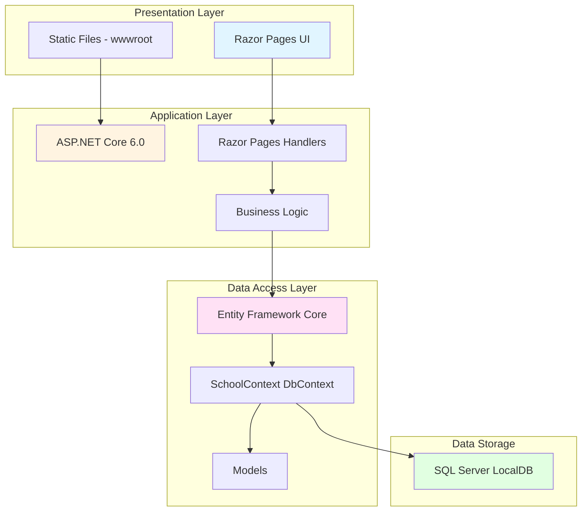

# ContosoUniversity Architecture Diagram

## Application Overview

This is a **Contoso University** web application built with ASP.NET Core 6.0, using Razor Pages for the presentation layer and Entity Framework Core for data access.

## Architecture Diagram

## Technology Stack

### Framework & Runtime
- **ASP.NET Core 6.0** - Web application framework (.NET 6.0)
- **Razor Pages** - Page-based UI development model

### Data Access
- **Entity Framework Core 6.0.2** - Object-Relational Mapper (ORM)
- **SQL Server** - Relational database (LocalDB for development)

### Key Dependencies
- `Microsoft.EntityFrameworkCore.SqlServer` (6.0.2) - SQL Server provider for EF Core
- `Microsoft.AspNetCore.Diagnostics.EntityFrameworkCore` (6.0.2) - Database diagnostics
- `Microsoft.EntityFrameworkCore.Tools` (6.0.2) - Migration and tooling support
- `Microsoft.VisualStudio.Web.CodeGeneration.Design` (6.0.2) - Code scaffolding

### UI Libraries
- **Bootstrap 5** - CSS framework for responsive design
- **jQuery** - JavaScript library
- **jQuery Validation** - Client-side form validation

## Application Components

### Domain Models
- **Student** - Student information and enrollments
- **Course** - Course catalog
- **Enrollment** - Student course registrations
- **Instructor** - Faculty information
- **Department** - Academic departments
- **OfficeAssignment** - Instructor office locations

### Data Context
- **SchoolContext** - Main EF Core DbContext for database operations
- **DbInitializer** - Seed data initialization

### Pages Structure
- **Courses** - CRUD operations for courses
- **Students** - Student management
- **Instructors** - Faculty management
- **Departments** - Department administration

## Database Configuration

- **Connection Type**: SQL Server with LocalDB
- **Connection String**: Configured in `appsettings.json`
- **Schema Management**: Entity Framework Core Migrations
- **Auto-Migration**: Database migrations applied on startup

## Key Architectural Patterns

1. **Page-Based Architecture** - Uses Razor Pages for simpler page-focused scenarios
2. **Repository Pattern** - Implemented through Entity Framework Core DbContext
3. **Code-First Database** - Database schema generated from C# models
4. **Dependency Injection** - Built-in ASP.NET Core DI container for service management

## Assessment Findings

Based on the AppCAT assessment report:

### Issues Identified
- **Total Issues**: 2
- **Story Points**: 6
- **Severity Breakdown**:
  - Optional: 1
  - Potential: 1

### Categories
1. **Scale** - Static files in wwwroot folder (33 files including Bootstrap, jQuery libraries)
2. **Connection** - Database connection configuration

### Migration Considerations

When migrating to Azure:

1. **Database Migration**
   - Consider migrating from LocalDB to Azure SQL Database
   - Update connection strings for cloud database
   - Review connection pooling and retry logic

2. **Static File Hosting**
   - Evaluate using Azure CDN for static assets (CSS, JS, images)
   - Consider Azure Storage for large static content
   - Optimize static file caching strategy

3. **Target Platforms** (All Compatible)
   - Azure App Service (Windows/Linux)
   - Azure Kubernetes Service (AKS)
   - Azure Container Apps (ACA)
   - Azure App Service Container
   - Azure App Service Managed Instance

4. **Recommendations**
   - Enable Application Insights for monitoring
   - Configure Azure Key Vault for connection strings
   - Implement proper logging and diagnostics
   - Review session state management for scale-out scenarios
   - Consider implementing health checks for production

## Data Flow

1. **User Request** → Razor Page
2. **Razor Page Handler** → Business Logic
3. **Business Logic** → Entity Framework Core
4. **EF Core** → SchoolContext (DbContext)
5. **SchoolContext** → SQL Server Database
6. **Response** → User via Razor Page View

## Configuration Files

- `appsettings.json` - Application settings and connection strings
- `appsettings.Development.json` - Development-specific settings
- `Program.cs` - Application startup and configuration

---

*Generated from AppCAT assessment on 2026-02-11*
