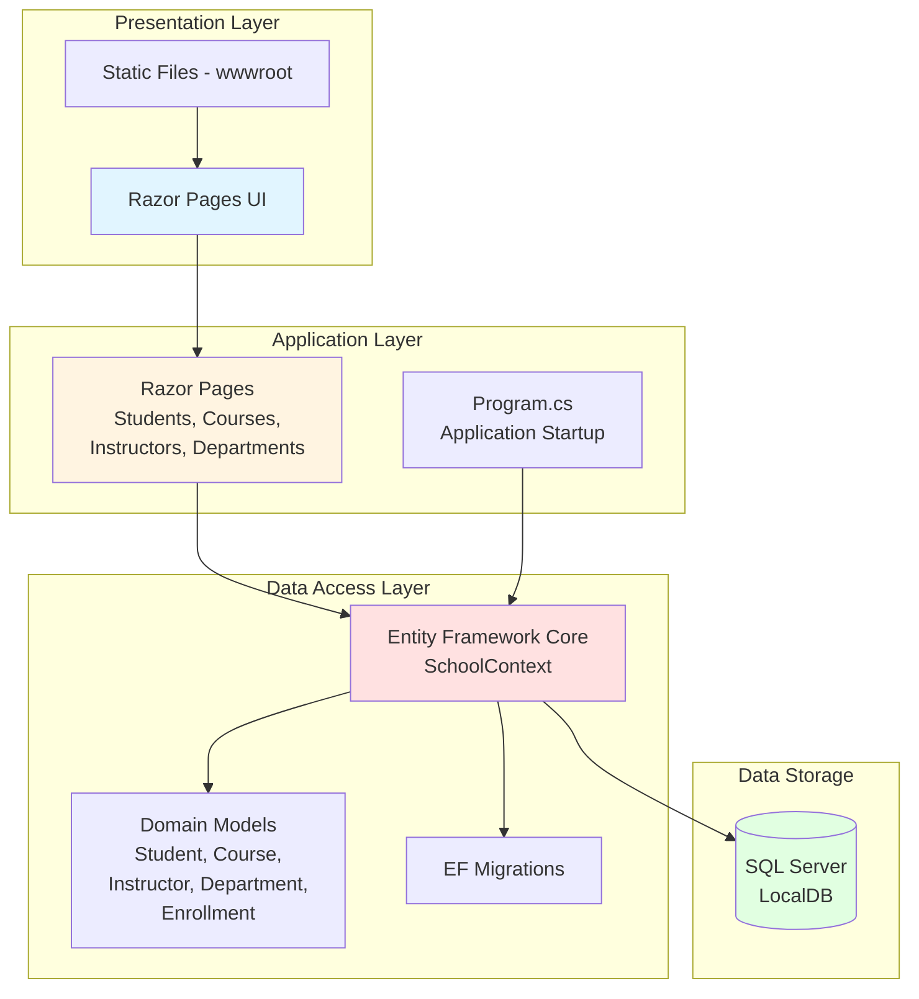

# ContosoUniversity - Architecture Diagram

## Application Overview

**Application Type:** ASP.NET Core Web Application (Razor Pages)  
**Framework:** .NET 6.0  
**Language:** C#  
**Build Tool:** MSBuild

## Architecture Diagram

## Technology Stack

### Frontend
- **UI Framework:** Razor Pages
- **CSS Framework:** Bootstrap 5
- **JavaScript Libraries:** jQuery, jQuery Validation

### Backend
- **Web Framework:** ASP.NET Core 6.0
- **ORM:** Entity Framework Core 6.0.2
- **Database Provider:** Microsoft.EntityFrameworkCore.SqlServer 6.0.2

### Database
- **Database:** SQL Server (LocalDB)
- **Connection:** Trusted Connection with MultipleActiveResultSets

### Development Tools
- **Code Generation:** Microsoft.VisualStudio.Web.CodeGeneration.Design 6.0.2
- **EF Tools:** Microsoft.EntityFrameworkCore.Tools 6.0.2
- **Diagnostics:** Microsoft.AspNetCore.Diagnostics.EntityFrameworkCore 6.0.2

## Application Structure

### Domain Models
- **Student** - Student information and enrollments
- **Course** - Course details and enrollments
- **Instructor** - Instructor information
- **Department** - Department information
- **Enrollment** - Student course enrollments
- **OfficeAssignment** - Instructor office assignments

### Pages (UI Components)
- Students - CRUD operations for students
- Courses - Course management
- Instructors - Instructor management
- Departments - Department management
- About - Statistics and reporting
- Index - Home page

### Data Layer
- **SchoolContext** - EF Core DbContext
- **DbInitializer** - Database seeding
- **Migrations** - Database schema versioning

## Key Features

1. **Database Initialization:** Automatic database migration and seeding on startup
2. **Pagination:** Custom pagination support (PageSize: 3)
3. **Error Handling:** 
   - Development: Developer exception page and migrations endpoint
   - Production: Custom error page with HSTS
4. **Static Files:** Bootstrap, jQuery, and custom CSS/JS

## Assessment Findings

**Total Issues Found:** 2  
**Total Story Points:** 6

### Issue Categories
- **Scale Issues:** 1 (Optional)
- **Connection Issues:** 1 (Potential)

### Key Findings
1. **Static Files (Scale.0001):** 33 static files in wwwroot folder (Bootstrap, jQuery libraries)
   - Severity: Optional
   - Effort: 3 story points
   - Recommendation: Consider using CDN for static assets in cloud deployment

2. **Database Connection:** SQL Server LocalDB connection string detected
   - Severity: Potential
   - Recommendation: Update connection string for cloud database (Azure SQL) when migrating

## Cloud Migration Readiness

### Compatible with Azure Targets
- Azure App Service (Windows/Linux)
- Azure Kubernetes Service (Linux/Windows)
- Azure Container Apps
- Azure App Service Container (Linux/Windows)
- Azure App Service Managed Instance (Windows)

### Migration Considerations
1. **Database:** Replace LocalDB with Azure SQL Database
2. **Static Assets:** Consider Azure CDN or Azure Blob Storage for static files
3. **Configuration:** Use Azure App Configuration or Key Vault for connection strings
4. **Monitoring:** Integrate Application Insights for monitoring and diagnostics

## Data Flow

1. **User Request** → Razor Pages UI
2. **Page Handler** → Entity Framework Core (SchoolContext)
3. **EF Core** → SQL Server Database
4. **Database** → Returns data to EF Core
5. **EF Core** → Maps to Domain Models
6. **Page Handler** → Renders Razor Page
7. **Response** → User sees rendered HTML

---

*Generated from AppCAT Assessment Report*  
*Analysis Date: 2026-02-10*
