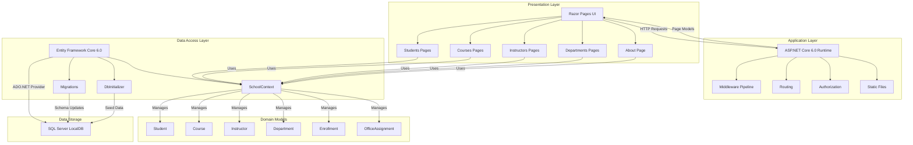

# ContosoUniversity Architecture Diagram

## Overview

ContosoUniversity is an ASP.NET Core 6.0 web application that demonstrates a university management system using Razor Pages and Entity Framework Core.

## Architecture Diagram

## Technology Stack

### Framework & Runtime
- **ASP.NET Core 6.0**: Web application framework
- **.NET 6.0**: Runtime platform
- **Razor Pages**: UI presentation model

### Data Access
- **Entity Framework Core 6.0.2**: ORM for data access
- **SQL Server Provider**: Database connectivity
- **EF Core Tools**: Development-time tooling
- **Migrations**: Database schema versioning

### Database
- **SQL Server LocalDB**: Development database
- **Connection String**: Configured in appsettings.json
- **Database Name**: SchoolContext

### Development Tools
- **Entity Framework Diagnostics**: Developer exception page
- **Code Generation**: Scaffolding support
- **Migration Endpoint**: Database migration UI

## Application Layers

### 1. Presentation Layer (Razor Pages)
- **Students**: CRUD operations for student management
- **Courses**: Course catalog and management
- **Instructors**: Instructor profiles and assignments
- **Departments**: Department organization
- **About**: Statistics and analytics
- **Shared Components**: Layout, navigation, error pages

### 2. Application Layer (ASP.NET Core)
- **Middleware Pipeline**: Request/response processing
- **Routing**: URL mapping to pages
- **Static Files**: CSS, JavaScript, images
- **HTTPS Redirection**: Security enforcement
- **Developer Exception Page**: Error handling (development)
- **HSTS**: HTTP Strict Transport Security (production)

### 3. Data Access Layer (Entity Framework Core)
- **SchoolContext**: Main DbContext managing all entities
- **Migrations**: Database schema versioning (EF Core Migrations)
- **DbInitializer**: Database seeding with sample data

### 4. Domain Model
- **Student**: Student information and enrollments
- **Course**: Course details and relationships
- **Instructor**: Instructor data and course assignments
- **Department**: Department organization
- **Enrollment**: Student-Course relationships with grades
- **OfficeAssignment**: Instructor office assignments

### 5. Data Storage
- **SQL Server LocalDB**: Relational database for persistence
- **SchoolContext Database**: Main application database

## Key Features

### Database Initialization
- Automatic migration on startup
- Seed data initialization via DbInitializer
- Database created if it doesn't exist

### Entity Relationships
- Many-to-Many: Courses ↔ Instructors
- One-to-Many: Students → Enrollments ← Courses
- One-to-One: Instructor → OfficeAssignment
- One-to-Many: Department → Courses

### Configuration
- **Connection Strings**: Managed in appsettings.json
- **Page Size**: Configurable pagination (default: 3)
- **Logging**: Configured for different environments
- **HTTPS**: Required in production

## Deployment Considerations

### Current Setup
- Development environment uses LocalDB
- Built on .NET 6.0 (LTS version)
- Uses Entity Framework Core 6.0.2

### Assessment Findings
Based on the AppCAT assessment, 2 issues were identified:
- **Story Points**: 6
- **Optional Issues**: 1
- **Potential Issues**: 1

For detailed assessment results, see `report.json` in this directory.

## Next Steps

1. Review the detailed assessment report (`report.json`)
2. Address identified issues before cloud migration
3. Consider upgrading to .NET 8.0 (latest LTS)
4. Plan database migration from LocalDB to Azure SQL Database
5. Review security configurations for cloud deployment
