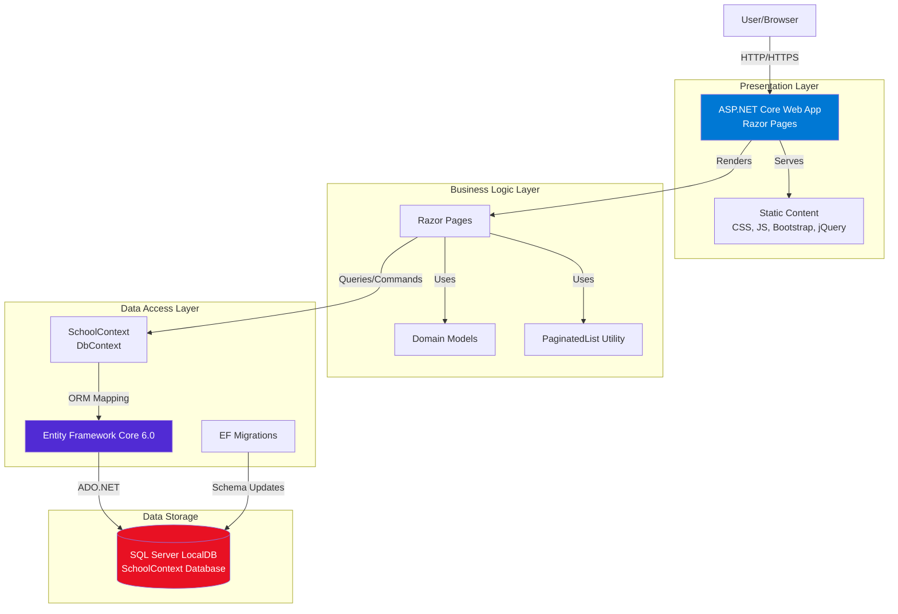

# ContosoUniversity Architecture Diagram

## Application Overview

**Application Type**: ASP.NET Core 6.0 Web Application (Razor Pages)  
**Framework**: .NET 6.0  
**Language**: C#  
**Build Tool**: MSBuild

## Architecture Diagram

## Technology Stack

### Frontend
- **UI Framework**: ASP.NET Core Razor Pages
- **CSS Framework**: Bootstrap 5
- **JavaScript Library**: jQuery
- **Static Assets**: Served from wwwroot directory

### Backend
- **Runtime**: .NET 6.0
- **Web Framework**: ASP.NET Core 6.0
- **ORM**: Entity Framework Core 6.0
- **Database Provider**: Microsoft.EntityFrameworkCore.SqlServer 6.0.2

### Database
- **Database Engine**: SQL Server (LocalDB)
- **Database Name**: SchoolContext
- **Connection**: Trusted Connection with MultipleActiveResultSets

### Development Tools
- **Diagnostics**: Microsoft.AspNetCore.Diagnostics.EntityFrameworkCore
- **Code Generation**: Microsoft.VisualStudio.Web.CodeGeneration.Design
- **Migration Tools**: Entity Framework Core Tools

## Key Components

### Domain Models
- Student, Course, Enrollment entities
- Located in `/Models` directory

### Data Layer
- `SchoolContext`: EF Core DbContext for database access
- `DbInitializer`: Database seeding logic
- Located in `/Data` directory

### Pages
- Razor Pages for CRUD operations
- Located in `/Pages` directory

### Utilities
- `PaginatedList<T>`: Generic pagination helper
- `Utility.cs`: Common utilities

## Assessment Findings

Based on AppCAT analysis, the application has **2 issues** for Azure migration:

### 1. Static Content Detection (Optional - 3 Story Points)
- **Category**: Scale
- **Issue**: 33 static files detected in wwwroot directory
- **Recommendation**: Move static content to Azure Blob Storage with Azure CDN
- **Benefits**: Reduced costs, better performance, easier maintenance, improved security

### 2. Connection String Detection (Potential - 3 Story Points)
- **Category**: Connection
- **Issue**: SQL Server connection string in appsettings.json
- **Recommendation**: 
  - Migrate database to Azure SQL Database
  - Consider Azure SQL Managed Instance for advanced features
  - Use Azure Migrate for database migration assessment
  - Update connection string for Azure environment

## Total Migration Effort

- **Total Issues**: 2
- **Total Story Points**: 6
- **Severity Breakdown**:
  - Mandatory: 0
  - Optional: 1
  - Potential: 1
  - Information: 0

## Target Azure Platforms

The application can be migrated to:
- Azure App Service (Windows/Linux)
- Azure Kubernetes Service (AKS)
- Azure Container Apps (ACA)
- Azure App Service Container
