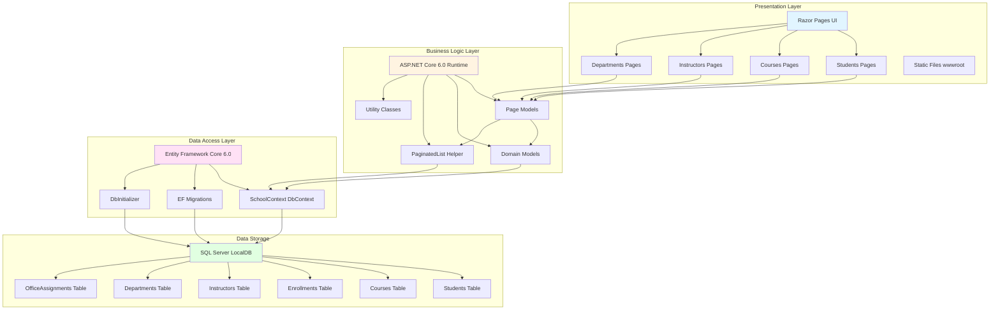

# ContosoUniversity Architecture Diagram

## Application Overview

ContosoUniversity is an ASP.NET Core 6.0 web application built with Razor Pages that manages university data including students, courses, instructors, and departments. The application follows a three-tier architecture pattern with presentation, business logic, and data access layers.

## Architecture Diagram

## Technology Stack

### Framework & Runtime
- **ASP.NET Core 6.0** - Web application framework
- **.NET 6.0** - Target framework
- **Razor Pages** - UI framework for page-based web applications

### Data Access
- **Entity Framework Core 6.0.2** - ORM for data access
- **EF Core SQL Server Provider** - Database provider for SQL Server
- **EF Core Tools** - Migration and scaffolding tools
- **EF Core Diagnostics** - Developer exception page for database errors

### Development Tools
- **Visual Studio Code Generation** - Scaffolding support for Razor Pages

### Database
- **SQL Server LocalDB** - Development database
- **Connection**: Trusted connection with MultipleActiveResultSets enabled

## Application Layers

### 1. Presentation Layer
- **Razor Pages (.cshtml)** - Server-side rendered UI pages
- **Page Models (.cshtml.cs)** - Code-behind for page logic
- **Static Files** - CSS, JavaScript, images in wwwroot
- **Pages organized by entity**: Students, Courses, Instructors, Departments

### 2. Business Logic Layer
- **Domain Models** - Entity classes (Student, Course, Enrollment, Instructor, Department, OfficeAssignment)
- **Page Models** - Handle HTTP requests and business logic
- **Helper Classes** - PaginatedList for pagination, Utility classes
- **Data Validation** - Data annotations on model properties

### 3. Data Access Layer
- **SchoolContext** - EF Core DbContext managing entity sets
- **Migrations** - Database schema version control
- **DbInitializer** - Seeds initial data into database
- **Entity Configurations** - Fluent API configurations for relationships

## Data Flow

1. **User Request** → Razor Page endpoint
2. **Page Model** → Processes request, invokes business logic
3. **Domain Models** → Represents business entities
4. **SchoolContext (EF Core)** → Translates LINQ queries to SQL
5. **SQL Server** → Executes queries, returns data
6. **Response** ← Data flows back through layers to UI

## Key Features

- **CRUD Operations** - Full create, read, update, delete for all entities
- **Pagination** - Custom PaginatedList implementation for large datasets
- **Relationships** - Many-to-many (Course-Instructor), One-to-many (Student-Enrollment)
- **Data Seeding** - Automatic initialization with sample data
- **Migration Support** - Automatic database migration on startup
- **Developer Tools** - Exception pages and diagnostics for development

## Database Schema

The application manages the following entities:
- **Student** - Student information and enrollment dates
- **Course** - Course details and department assignments
- **Enrollment** - Student course enrollments with grades
- **Instructor** - Instructor information
- **Department** - Academic departments with budgets and administrators
- **OfficeAssignment** - One-to-one relationship with instructors

## Configuration

- **Connection String** - Configured in appsettings.json
- **Page Size** - Configurable pagination (default: 3 items per page)
- **Logging** - ASP.NET Core logging with configurable levels
- **HTTPS** - Enabled with redirection
- **HSTS** - HTTP Strict Transport Security in production
