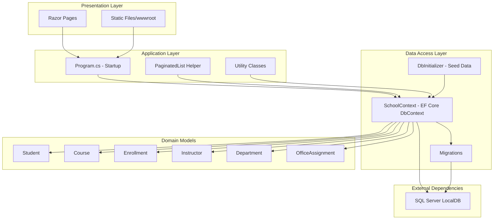
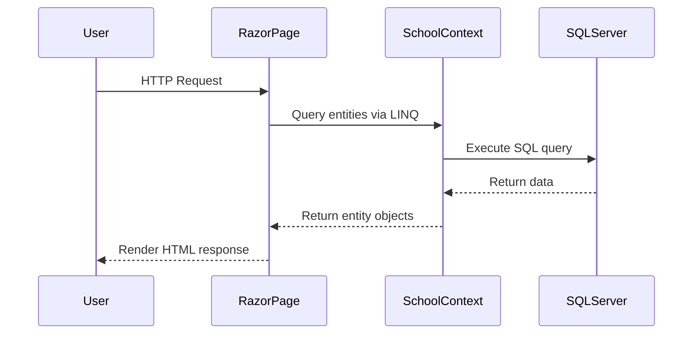

# ContosoUniversity Architecture Diagram

## Application Overview

ContosoUniversity is an ASP.NET Core 6.0 web application built with Razor Pages for managing university data including students, courses, instructors, and enrollments.

## Technology Stack

- **Framework**: ASP.NET Core 6.0
- **UI Framework**: Razor Pages
- **ORM**: Entity Framework Core 6.0
- **Database**: SQL Server (LocalDB)
- **Language**: C# with .NET 6.0

## High-Level Architecture

## Component Details

### Presentation Layer
- **Razor Pages**: Server-side rendered web pages handling user interactions
- **Static Files**: CSS, JavaScript, and other static assets served from wwwroot

### Application Layer
- **Program.cs**: Application startup and configuration
  - Configures Razor Pages
  - Sets up Entity Framework Core DbContext
  - Configures middleware pipeline (HTTPS redirection, static files, routing, authorization)
  - Initializes database with seed data
- **PaginatedList**: Helper class for paginated query results
- **Utility Classes**: Common utility functions

### Data Access Layer
- **SchoolContext**: Entity Framework Core DbContext managing database access
  - Provides DbSet properties for each entity
  - Configures entity relationships and table mappings
- **DbInitializer**: Seeds initial data into the database
- **Migrations**: EF Core migrations for database schema versioning

### Domain Models
- **Student**: Student information
- **Course**: Course catalog
- **Enrollment**: Student course enrollments with grades
- **Instructor**: Instructor information
- **Department**: Academic departments
- **OfficeAssignment**: Instructor office assignments

### External Dependencies
- **SQL Server LocalDB**: Local development database
  - Connection string configured in appsettings.json
  - Supports Entity Framework Core migrations

## Data Flow

## Key NuGet Packages

- **Microsoft.AspNetCore.Diagnostics.EntityFrameworkCore** (6.0.2): EF Core diagnostics
- **Microsoft.EntityFrameworkCore.SqlServer** (6.0.2): SQL Server provider for EF Core
- **Microsoft.EntityFrameworkCore.Tools** (6.0.2): EF Core migration tools
- **Microsoft.VisualStudio.Web.CodeGeneration.Design** (6.0.2): Code generation for scaffolding

## Configuration

- **appsettings.json**: Application configuration
  - Connection strings for SchoolContext
  - Logging configuration
  - Page size settings
  - Allowed hosts

## Deployment Considerations

- Uses LocalDB connection string (development-focused)
- Database migrations run automatically on startup
- HTTPS redirection enabled
- Developer exception page and migration endpoint in development mode
- HSTS enabled for production environments
