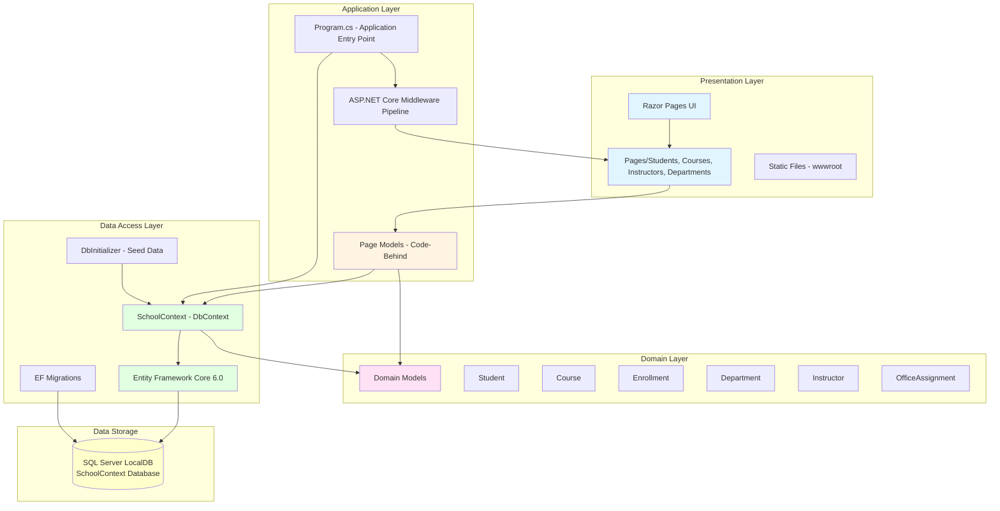

# ContosoUniversity Architecture Diagram

This diagram provides a high-level overview of the ContosoUniversity application architecture based on the assessment results.

## Application Architecture

## Technology Stack

### Framework & Platform
- **Framework**: ASP.NET Core 6.0
- **Application Type**: Razor Pages Web Application
- **Target Framework**: .NET 6.0

### UI Layer
- **Technology**: Razor Pages (Server-side rendering)
- **Static Files**: wwwroot directory for CSS, JavaScript, images

### Data Access
- **ORM**: Entity Framework Core 6.0.2
- **Database Provider**: Microsoft.EntityFrameworkCore.SqlServer
- **Database**: SQL Server LocalDB (Development)
- **Migrations**: Entity Framework Migrations for schema management

### Development Tools
- **Diagnostics**: Microsoft.AspNetCore.Diagnostics.EntityFrameworkCore
- **Code Generation**: Microsoft.VisualStudio.Web.CodeGeneration.Design
- **EF Tools**: Microsoft.EntityFrameworkCore.Tools

## Application Structure

### Domain Model
The application manages a university system with the following entities:
- **Student**: Student information with enrollments
- **Course**: Course catalog with credits and departments
- **Enrollment**: Student-Course relationship with grades
- **Department**: Academic departments
- **Instructor**: Faculty information
- **OfficeAssignment**: Instructor office locations

### Key Features
- Student management (CRUD operations)
- Course management
- Enrollment tracking with grades
- Department management
- Instructor management
- Data seeding for development/testing
- Automatic database migration on startup
- Pagination support (configurable page size)

### Configuration
- **Connection String**: Configured in appsettings.json
- **Page Size**: Configurable (default: 3)
- **Database**: Auto-migration enabled in Program.cs
- **Privacy Mode**: Protected mode for assessment reports

## Deployment Considerations

### Current State
- Desktop application using SQL Server LocalDB
- Development-focused configuration
- No production deployment configuration present

### Modernization Opportunities
Based on the AppCAT assessment (2 issues discovered):
- Migration to cloud-ready database (Azure SQL Database)
- Configuration externalization for different environments
- Scalability improvements for multi-user scenarios
- Production-ready connection string management
- Container deployment readiness

---

*Generated from AppCAT assessment on 2026-02-10*
