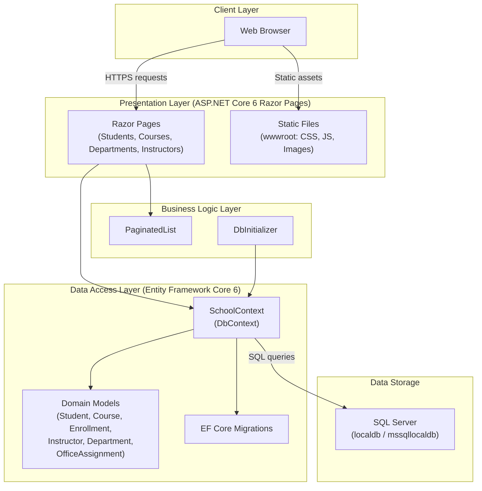

# ContosoUniversity Architecture Diagram

## Application Architecture

## Technology Stack

| Layer | Technology |
|-------|-----------|
| Framework | ASP.NET Core 6 (net6.0) |
| UI | Razor Pages |
| ORM | Entity Framework Core 6 |
| Database | SQL Server (localdb) |
| Language | C# |

## Assessment Summary

Based on AppCAT analysis, **2 issues** were identified:

| Category | Severity | Description |
|----------|----------|-------------|
| Scale | Optional | Static content served from application (wwwroot) — consider Azure CDN or Azure Blob Storage for scalability |
| Connection | Potential | SQL Server connection string in appsettings.json — migrate to Azure SQL Database with managed identity or Azure Key Vault |

## Migration Considerations

- **Static Content**: Move static assets (CSS, JS, images) to Azure Blob Storage with Azure CDN for improved performance and scalability
- **Database**: Migrate from SQL Server localdb to **Azure SQL Database**; use managed identity instead of connection strings in config files
- **Hosting**: Application is compatible with Azure App Service (Windows/Linux), Azure Kubernetes Service, and Azure Container Apps
