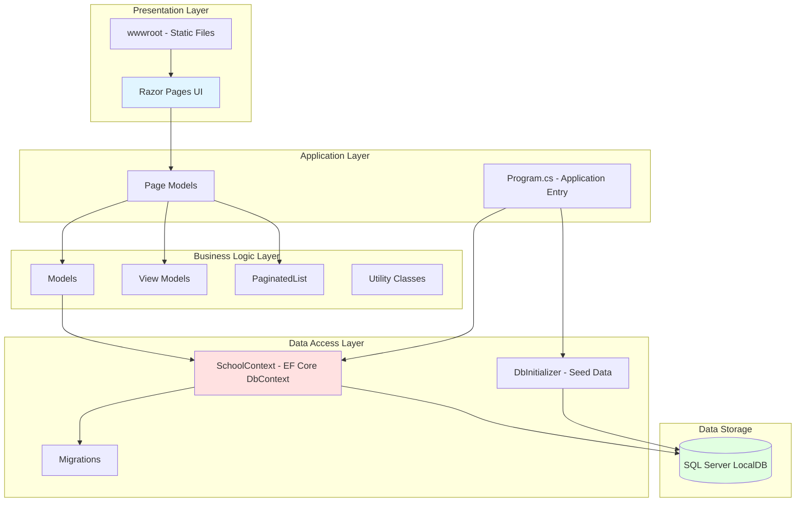

# ContosoUniversity Application Architecture

## Overview

ContosoUniversity is an ASP.NET Core 6.0 web application implementing a university management system using Razor Pages and Entity Framework Core with SQL Server.

## Architecture Diagram

## Technology Stack

### Framework & Runtime
- **ASP.NET Core 6.0** (SDK: Microsoft.NET.Sdk.Web)
- **C# with Implicit Usings**
- **.NET 6.0 Target Framework**

### UI Layer
- **Razor Pages** - Server-side page-based framework
- **Static Files** - CSS, JavaScript, images in wwwroot

### Data Access
- **Entity Framework Core 6.0.2** - ORM for data access
- **Microsoft.EntityFrameworkCore.SqlServer 6.0.2** - SQL Server provider
- **Code-First Migrations** - Database schema management

### Database
- **SQL Server LocalDB** - Development database
- **Connection String**: Uses Windows Authentication with LocalDB instance
- **Database Name**: SchoolContext

### Development Tools
- **Entity Framework Core Tools 6.0.2** - CLI and Package Manager Console tools
- **Code Generation Design 6.0.2** - Scaffolding support
- **Database Developer Page Exception Filter** - Enhanced error pages in development

## Application Components

### Domain Models
- **Student** - Student information and enrollments
- **Course** - Course catalog and assignments
- **Enrollment** - Student course registrations
- **Instructor** - Faculty information
- **Department** - Academic departments
- **OfficeAssignment** - Instructor office locations

### Data Layer
- **SchoolContext** - Main DbContext with 6 DbSets (Courses, Enrollments, Students, Departments, Instructors, OfficeAssignments)
- **DbInitializer** - Seeds initial data on application startup
- **Migrations** - Database version control

### Application Features
- **Pagination** - PaginatedList utility for paged data
- **Auto Migration** - Database.Migrate() on startup
- **Development Exception Pages** - Enhanced debugging in development mode
- **HTTPS Redirection** - Enforced secure connections
- **Static File Serving** - wwwroot content delivery

## Architecture Patterns

### Pattern: N-Tier Architecture
- Clear separation between UI, business logic, and data access
- Razor Pages combining presentation and page-specific logic
- Entity Framework Core as data access abstraction

### Pattern: Repository Pattern (via DbContext)
- DbContext acts as Unit of Work
- DbSet collections provide repository-like access
- Migrations manage schema changes

### Pattern: Code-First Development
- Domain models define database schema
- Migrations track schema evolution
- DbInitializer provides seed data

## Configuration

### Application Settings (appsettings.json)
- **PageSize**: 3 (pagination configuration)
- **Logging**: Information level by default, Warning for ASP.NET Core
- **AllowedHosts**: "*" (all hosts allowed)
- **ConnectionStrings**: SchoolContext pointing to LocalDB

### Application Pipeline (Program.cs)
1. **Service Registration**: Razor Pages, DbContext, Database Developer Page Filter
2. **Middleware Configuration**: Exception handling, HSTS, HTTPS redirection, static files, routing, authorization
3. **Database Initialization**: Auto-migration and seed data on startup

## Assessment Summary

Based on the AppCAT assessment report:

- **Issues Discovered**: 2
- **Incidents**: 2
- **Story Points**: 6
- **Severity**: 1 Optional, 1 Potential
- **Target Framework**: .NET 6.0 (modern framework)

The application follows modern ASP.NET Core practices with Entity Framework Core for data access, making it relatively straightforward for cloud migration scenarios.

## Modernization Considerations

### Current State
- Modern .NET 6.0 application
- Uses Entity Framework Core (cloud-compatible ORM)
- Follows ASP.NET Core best practices
- LocalDB dependency (development-focused)

### Potential Improvements for Cloud
- Replace LocalDB with cloud-managed SQL database (Azure SQL, Amazon RDS)
- Implement proper connection string management (Azure Key Vault, AWS Secrets Manager)
- Add health checks for containerization
- Configure for horizontal scaling (session state, static file storage)
- Implement structured logging (Application Insights, CloudWatch)

---

*Generated by AppCAT Assessment Tool v1.0.601*
*Assessment Date: 2026-02-07*
