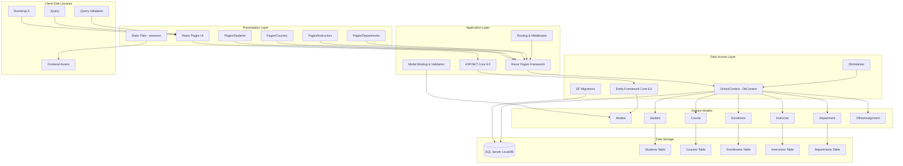

# ContosoUniversity Application Architecture

## Overview

ContosoUniversity is an ASP.NET Core 6.0 web application built using Razor Pages architecture, demonstrating a university management system with Entity Framework Core for data access.

## Architecture Diagram

## Component Details

### Presentation Layer
- **Razor Pages**: Server-side rendered pages for CRUD operations
  - Student management pages
  - Course management pages
  - Instructor management pages
  - Department management pages
  - Home and About pages
- **Static Files**: CSS, JavaScript, and frontend libraries served from wwwroot

### Application Layer
- **ASP.NET Core 6.0**: Web framework providing:
  - Razor Pages framework for page-based development
  - Model binding and validation
  - Routing and middleware pipeline
  - Dependency injection
  - Configuration management

### Data Access Layer
- **Entity Framework Core 6.0**: ORM for database operations
  - SchoolContext: Main DbContext managing all entities
  - DbInitializer: Seeds initial data
  - Code-First Migrations: Database schema versioning
  - LINQ query support

### Domain Models
Six core entities representing the university domain:
- **Student**: Student information and enrollments
- **Course**: Course details and relationships
- **Enrollment**: Student-Course many-to-many relationship
- **Instructor**: Instructor information
- **Department**: Academic departments
- **OfficeAssignment**: Instructor office assignments

### Data Storage
- **SQL Server LocalDB**: Development database
  - Connection managed through appsettings.json
  - Schema created and managed via EF Core migrations
  - Supports multiple active result sets

### Client-Side Libraries
- **Bootstrap 5**: Responsive UI framework
- **jQuery**: DOM manipulation and AJAX
- **jQuery Validation**: Client-side form validation

## Technology Stack Summary

| Layer | Technology | Version |
|-------|-----------|---------|
| Framework | ASP.NET Core | 6.0 |
| UI Pattern | Razor Pages | 6.0 |
| ORM | Entity Framework Core | 6.0 |
| Database | SQL Server | LocalDB |
| CSS Framework | Bootstrap | 5.x |
| JavaScript | jQuery | 3.x |
| Build | MSBuild | .NET SDK |

## Data Flow

1. **User Request**: Browser sends HTTP request to ASP.NET Core
2. **Routing**: Request routed to appropriate Razor Page
3. **Model Binding**: Page model binds request data
4. **Business Logic**: Page handlers execute business operations
5. **Data Access**: EF Core translates LINQ to SQL queries
6. **Database**: SQL Server executes queries and returns data
7. **Response**: Razor engine renders HTML with data
8. **Client**: Browser receives and displays HTML response

## Key Architecture Patterns

- **Repository Pattern**: Implemented via Entity Framework Core DbContext
- **Unit of Work**: DbContext manages transactions and change tracking
- **Dependency Injection**: Services registered in Program.cs
- **Code-First Development**: Database schema defined via C# models
- **Page-Based Architecture**: Self-contained page models with handlers

## Configuration

- **appsettings.json**: Application configuration
  - Connection strings
  - Logging configuration
  - Page size settings
- **Program.cs**: Application startup and service configuration
  - Database context registration
  - Migration execution on startup
  - Middleware pipeline configuration

## Assessment Insights

Based on the AppCAT assessment report:
- **Total Issues**: 2 detected
- **Story Points**: 6 effort
- **Severity**: 1 optional, 1 potential
- **Categories**: Scale, Connection
- **Primary Issue**: Static files in wwwroot (33 files) may need CDN consideration for scale
- **Migration Targets**: Compatible with Azure App Service, AKS, ACA, Container Apps
