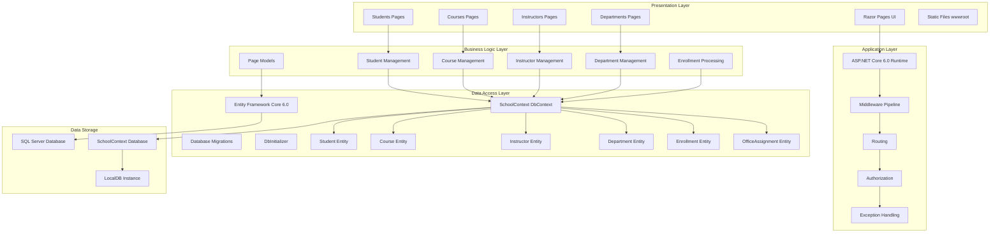

# ContosoUniversity Architecture Diagram

## Application Overview

ContosoUniversity is an ASP.NET Core 6.0 web application built with Razor Pages that manages university data including students, courses, instructors, and departments.

## Architecture Diagram

## Technology Stack

### Frontend
- **Framework**: ASP.NET Core Razor Pages
- **UI Technology**: HTML, CSS, JavaScript
- **Static Files**: Served from wwwroot directory

### Backend
- **Runtime**: .NET 6.0
- **Web Framework**: ASP.NET Core 6.0
- **Architecture Pattern**: Page-based MVC (Razor Pages)

### Data Access
- **ORM**: Entity Framework Core 6.0
- **Database Provider**: Microsoft.EntityFrameworkCore.SqlServer
- **Migration Tool**: EF Core Migrations

### Database
- **Database System**: SQL Server
- **Development Database**: LocalDB (mssqllocaldb)
- **Connection**: Trusted Connection with Multiple Active Result Sets

### Development Tools
- **Diagnostics**: Microsoft.AspNetCore.Diagnostics.EntityFrameworkCore
- **Code Generation**: Microsoft.VisualStudio.Web.CodeGeneration.Design
- **Developer Page**: Database error page for development environment

## Key Components

### Domain Models
- **Student**: Student information and enrollments
- **Course**: Course details and relationships
- **Instructor**: Instructor data and office assignments
- **Department**: Department information
- **Enrollment**: Student-Course enrollment relationship
- **OfficeAssignment**: Instructor office assignment details

### Data Context
- **SchoolContext**: Main DbContext managing all entities
- **DbInitializer**: Seeds initial data into the database

### Pages Structure
- **Students**: CRUD operations for student management
- **Courses**: Course listing and management
- **Instructors**: Instructor information management
- **Departments**: Department administration
- **About**: Statistics and information pages

## Data Flow

1. **User Request**: Browser sends HTTP request to ASP.NET Core application
2. **Routing**: Request is routed to appropriate Razor Page
3. **Page Model**: Page model processes request and interacts with data layer
4. **EF Core**: Entity Framework Core translates LINQ queries to SQL
5. **Database**: SQL Server executes queries and returns data
6. **Response**: Data is rendered in Razor view and returned to browser

## Configuration

- **Logging**: Configured for Information level (Default) and Warning level (ASP.NET Core)
- **Connection String**: Uses LocalDB with trusted connection
- **Page Size**: Configured to 3 items per page
- **HTTPS**: Redirection enabled
- **Static Files**: Enabled for serving wwwroot content
- **Database Migrations**: Automatically applied on application startup

## Application Characteristics

- **Type**: Web Application
- **Pattern**: N-Tier Architecture (Presentation, Business Logic, Data Access)
- **Database Strategy**: Code-First with EF Core Migrations
- **Deployment**: Can run on Windows with LocalDB or SQL Server
