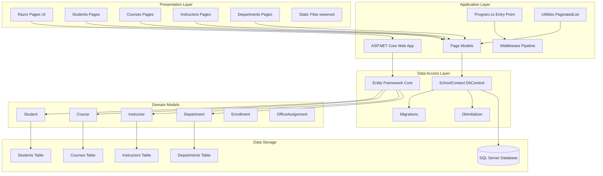

# ContosoUniversity Application Architecture

## Architecture Overview

This document provides a high-level architecture diagram of the ContosoUniversity application based on the assessment analysis.

## Technology Stack

- **Framework**: ASP.NET Core 6.0 (Razor Pages)
- **Database**: SQL Server (LocalDB)
- **ORM**: Entity Framework Core 6.0.2
- **UI**: Razor Pages with Bootstrap

## Architecture Diagram

## Component Description

### Presentation Layer
- **Razor Pages**: Server-side rendered web pages organized by entity (Students, Courses, Instructors, Departments)
- **Static Files**: CSS, JavaScript, and other static assets served from wwwroot
- **UI Framework**: Bootstrap for responsive design

### Application Layer
- **ASP.NET Core Web Application**: Main application host with middleware pipeline
- **Page Models**: Code-behind files for Razor Pages handling HTTP requests and business logic
- **Utilities**: Helper classes like PaginatedList for common functionality

### Data Access Layer
- **SchoolContext**: Entity Framework Core DbContext managing database operations
- **Migrations**: Database schema versioning and updates using EF Core migrations
- **DbInitializer**: Seed data initialization for development and testing

### Domain Models
- **Student**: Student entity with enrollments
- **Course**: Course entity with instructors and enrollments
- **Instructor**: Instructor entity with courses and office assignments
- **Department**: Department entity managing courses
- **Enrollment**: Many-to-many relationship between students and courses
- **OfficeAssignment**: One-to-one relationship with instructors

### Data Storage
- **SQL Server Database**: Relational database using LocalDB for development
- **Connection String**: Configured in appsettings.json
- **Schema**: Tables for Students, Courses, Instructors, Departments, Enrollments, and OfficeAssignments

## Key Dependencies

| Package | Version | Purpose |
|---------|---------|---------|
| Microsoft.EntityFrameworkCore.SqlServer | 6.0.2 | SQL Server database provider |
| Microsoft.AspNetCore.Diagnostics.EntityFrameworkCore | 6.0.2 | EF Core error page middleware |
| Microsoft.EntityFrameworkCore.Tools | 6.0.2 | EF Core design-time tools |
| Microsoft.VisualStudio.Web.CodeGeneration.Design | 6.0.2 | Scaffolding support |

## Data Flow

1. **User Request**: Browser sends HTTP request to Razor Page
2. **Page Model Processing**: Page model handles request and invokes business logic
3. **Data Access**: Page model uses SchoolContext to query/update database via Entity Framework Core
4. **Database Operation**: EF Core translates LINQ queries to SQL and executes against SQL Server
5. **Response Rendering**: Page model passes data to Razor view for HTML rendering
6. **User Response**: Rendered HTML returned to browser

## Migration Considerations

Based on the assessment, the following areas should be considered for Azure migration:

- **Database**: Currently using LocalDB - needs migration to Azure SQL Database
- **Connection Strings**: Update to use Azure SQL Database connection strings
- **Authentication**: Consider Azure AD integration for enterprise scenarios
- **Hosting**: Deploy to Azure App Service for web hosting
- **Configuration**: Use Azure App Configuration or Key Vault for sensitive settings
- **Monitoring**: Integrate Application Insights for monitoring and diagnostics

## Assessment Summary

- **Issues Found**: 2 issues detected by AppCAT
- **Story Points**: 6 estimated story points for migration
- **Severity**: 1 Optional, 1 Potential
- **Target Platform**: Azure (Any)

For detailed assessment results, see [report.json](report.json).
