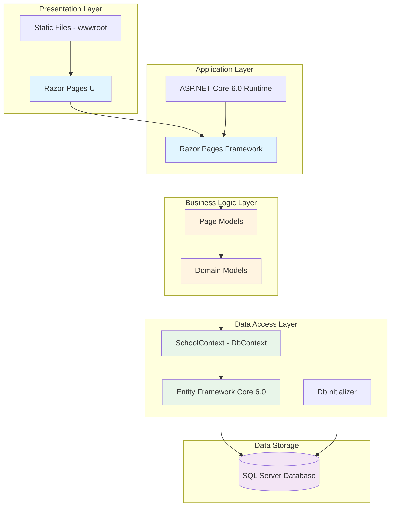

# ContosoUniversity - Application Architecture

## Overview

ContosoUniversity is an ASP.NET Core 6.0 web application built using Razor Pages. The application demonstrates a simple university management system with students, courses, departments, and instructors.

## Architecture Diagram



## Technology Stack

### Frontend
- **Framework**: ASP.NET Core Razor Pages
- **UI Libraries**: 
  - Bootstrap 5.x (CSS framework)
  - jQuery 3.x (JavaScript library)
  - jQuery Validation (client-side validation)

### Backend
- **Runtime**: .NET 6.0
- **Web Framework**: ASP.NET Core 6.0
- **Architecture Pattern**: Page-based MVC (Razor Pages)

### Data Access
- **ORM**: Entity Framework Core 6.0
- **Database Provider**: Microsoft.EntityFrameworkCore.SqlServer
- **Migration Support**: EF Core Migrations

### Database
- **Type**: SQL Server
- **Connection**: LocalDB for development
- **Features**:
  - Multiple Active Result Sets (MARS) enabled
  - Trusted Connection authentication

## Application Components

### Domain Models
- **Student**: Student information and enrollments
- **Course**: Course details and relationships
- **Enrollment**: Student-course enrollments with grades
- **Department**: Academic departments
- **Instructor**: Faculty information
- **OfficeAssignment**: Instructor office assignments

### Key Features
- Student management (CRUD operations)
- Course management
- Department management
- Instructor management
- Enrollment tracking
- Pagination support (PaginatedList)
- Database seeding (DbInitializer)

## Data Flow

1. **User Request**: Browser sends HTTP request to Razor Page
2. **Page Processing**: Razor Page Model handles request and business logic
3. **Data Access**: Page Model uses SchoolContext (EF Core DbContext) to query/update data
4. **Database Operations**: Entity Framework translates to SQL and executes against SQL Server
5. **Response**: Data is bound to Razor Page and rendered as HTML
6. **User Response**: HTML response sent back to browser

## Configuration

### Application Settings
- **Configuration Files**: 
  - `appsettings.json` (base configuration)
  - `appsettings.Development.json` (development overrides)
- **Key Settings**:
  - PageSize: 3 (pagination)
  - Logging levels
  - Connection strings

### Connection String
```
Server=(localdb)\mssqllocaldb;
Database=SchoolContext-a8778b0f-1bfd-4d0f-a500-09390a0df97f;
Trusted_Connection=True;
MultipleActiveResultSets=true
```

## Migration Considerations

### Assessment Findings

**Total Issues**: 2  
**Total Effort**: 6 story points  

#### Issue Categories:
1. **Scale** (Rule: Scale.0001)
   - Static files bundled in wwwroot directory (33 files)
   - Consideration: For cloud deployment, consider using CDN for static assets

2. **Connection** (Rule: Connection.0001)
   - Connection string in appsettings.json
   - Consideration: Use Azure Key Vault or managed configuration for cloud deployments

### Cloud Readiness

The application follows modern .NET patterns and is generally cloud-ready with minimal modifications needed:

✅ **Strengths**:
- Modern .NET 6.0 stack
- Entity Framework Core with code-first migrations
- Configuration-based connection strings
- Separation of concerns (layered architecture)
- Dependency injection ready

⚠️ **Considerations**:
- Static files should be moved to Azure CDN or Storage for better scalability
- Connection strings should use Azure Key Vault or App Configuration
- Database migrations should be handled via CI/CD pipelines
- Consider using Azure SQL Database instead of SQL Server LocalDB

## Deployment Targets

Based on the assessment, this application can be deployed to:
- **Azure App Service** (Windows or Linux)
- **Azure Kubernetes Service** (AKS)
- **Azure Container Apps** (ACA)
- **Azure App Service Containers**

## Next Steps

1. Review the detailed assessment report: `.github/modernize/report.json`
2. Address the identified issues (static files, connection strings)
3. Plan database migration strategy (LocalDB → Azure SQL)
4. Set up CI/CD pipeline for automated deployments
5. Configure Azure resources (App Service, SQL Database, Key Vault)
6. Implement health checks and monitoring
7. Test application in target Azure environment
