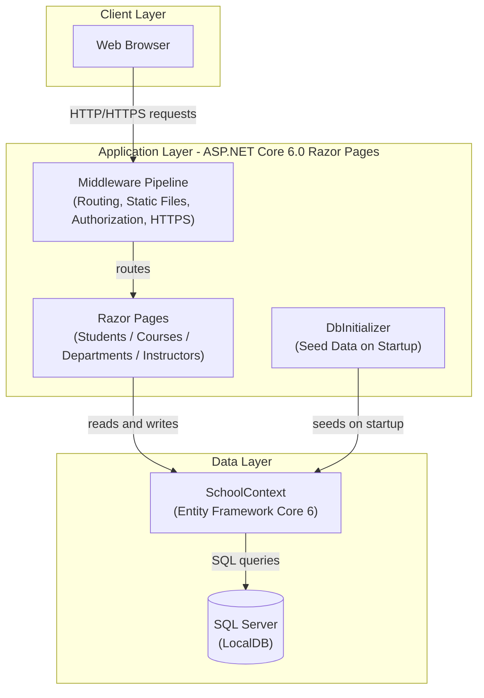
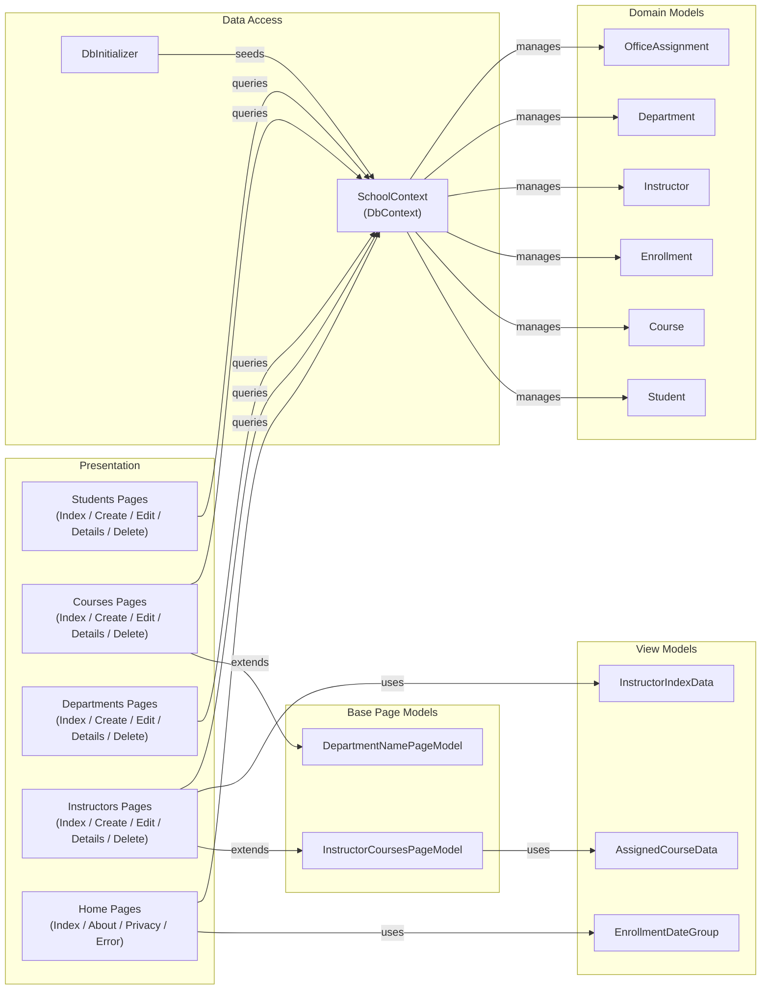

# Architecture Diagram

Contoso University is an ASP.NET Core 6.0 Razor Pages web application that manages university data (students, courses, instructors, and departments) using Entity Framework Core with a SQL Server backend.

## Application Architecture

## Component Relationships

