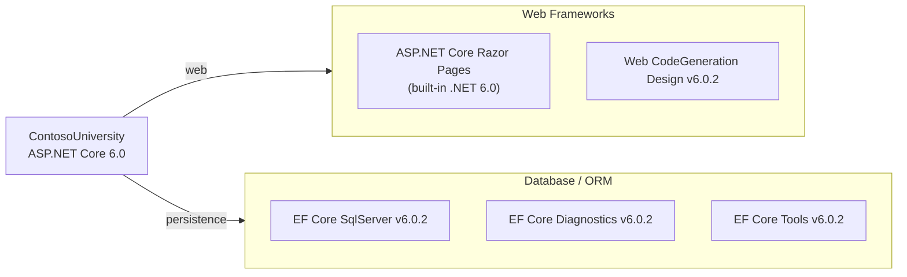

# Dependency Map

Contoso University is an ASP.NET Core 6.0 Razor Pages application with 4 declared NuGet package dependencies.

## Dependencies

```mermaid
flowchart LR
    App["ContosoUniversity\nASP.NET Core 6.0"]

    subgraph Web["Web Frameworks"]
        RazorPages["ASP.NET Core Razor Pages\n(built-in .NET 6.0)"]
        CodeGen["Web CodeGeneration Design v6.0.2"]
    end
    subgraph DB["Database / ORM"]
        EFCore["EF Core SqlServer v6.0.2"]
        EFDiag["EF Core Diagnostics v6.0.2"]
        EFTools["EF Core Tools v6.0.2"]
    end

    App -->|"web"| Web
    App -->|"persistence"| DB
```
