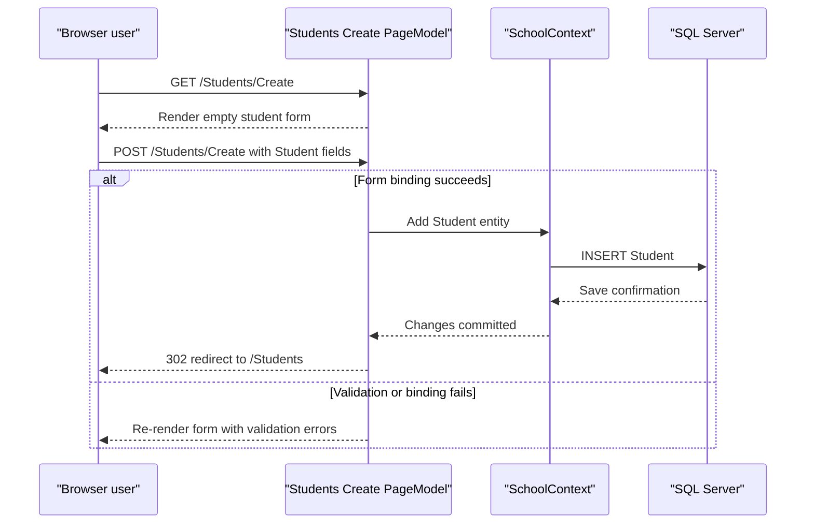

# API & Service Communication Contracts

ContosoUniversity exposes a small server-rendered HTTP surface through Razor Pages rather than a JSON-first REST API. The request flow is synchronous throughout: browser requests are handled by PageModel classes, which query or update EF Core entities and then return HTML pages or redirects.

## Service Catalog

| Service | Port | Category | Purpose |
| --- | --- | --- | --- |
| ContosoUniversity | HTTPS 7192, HTTP 5202, IIS Express 31248/44319 | API Layer | Single web application that renders academic administration pages and processes form posts for students, courses, departments, instructors, and reporting views |

## API Endpoints Inventory

| Service | Method | Path | Request Type | Response Type |
| --- | --- | --- | --- | --- |
| ContosoUniversity | GET | `/` | None | Razor page response |
| ContosoUniversity | GET | `/About` | None | Razor page response with `EnrollmentDateGroup` summary data |
| ContosoUniversity | GET | `/Students` | Query string: `sortOrder`, `currentFilter`, `searchString`, `pageIndex` | Razor page response backed by `PaginatedList<Student>` |
| ContosoUniversity | GET / POST | `/Students/Create` | Student form fields (`Student`) | Redirect to `/Students` on success or Razor page with validation errors |
| ContosoUniversity | GET / POST | `/Students/Edit` | Route/query `id` plus student form fields (`Student`) | Redirect to `/Students` on success or Razor page |
| ContosoUniversity | GET / POST | `/Students/Delete` | Route/query `id` | Redirect to `/Students` or Razor page showing delete error state |
| ContosoUniversity | GET | `/Students/Details` | Route/query `id` | Razor page with `Student` plus related `Enrollment` and `Course` data |
| ContosoUniversity | GET | `/Courses` | None | Razor page with course list and departments |
| ContosoUniversity | GET / POST | `/Courses/Create`, `/Courses/Edit`, `/Courses/Delete` | Course form fields (`Course`) or route/query `id` | Redirect to `/Courses` on success or Razor page |
| ContosoUniversity | GET | `/Courses/Details` | Route/query `id` | Razor page with `Course` and `Department` |
| ContosoUniversity | GET | `/Departments` | None | Razor page with department list and administrators |
| ContosoUniversity | GET / POST | `/Departments/Create`, `/Departments/Edit`, `/Departments/Delete` | Department form fields (`Department`) or route/query `id` | Redirect to `/Departments` on success, or Razor page with concurrency feedback |
| ContosoUniversity | GET | `/Departments/Details` | Route/query `id` | Razor page with `Department` and administrator details |
| ContosoUniversity | GET | `/Instructors` | Optional query `id`, `courseID` for drill-down | Razor page with `InstructorIndexData` including courses and enrollments |
| ContosoUniversity | GET / POST | `/Instructors/Create`, `/Instructors/Edit`, `/Instructors/Delete` | Instructor form fields (`Instructor`) plus selected course IDs | Redirect to `/Instructors` on success or Razor page |
| ContosoUniversity | GET | `/Instructors/Details` | Route/query `id` | Razor page with `Instructor`, office assignment, and courses |

## Management & Observability Endpoints

| Service | Endpoint | Custom Metrics (if any) |
| --- | --- | --- |
| ContosoUniversity | No dedicated health, metrics, Swagger, or management endpoints discovered in source | None discovered |

## DTOs & Contracts

The application primarily binds EF Core entity classes directly to Razor Page forms instead of maintaining a separate API DTO layer. `Student`, `Course`, `Department`, and `Instructor` act as request and response contract types for create and edit forms, while `Enrollment`, `OfficeAssignment`, and related navigation properties enrich detail pages. View-model types such as `PaginatedList<Student>`, `InstructorIndexData`, `AssignedCourseData`, and `EnrollmentDateGroup` support read-only page composition and reporting. No OpenAPI, GraphQL, or protobuf schemas were found, and serialization concerns are limited because responses are rendered as HTML rather than JSON.

## Communication Patterns

All communication is synchronous and in-process: browser requests invoke Razor Page handlers, handlers use `SchoolContext` and EF Core LINQ queries, and results are returned as HTML or redirects. No inter-service REST calls, message brokers, service discovery, gateways, or resilience libraries were found. The closest thing to startup coordination is the application boot sequence, where `Program` opens a scoped `SchoolContext`, applies migrations, and seeds sample data before the web app starts accepting requests. Concurrency protection is implemented for department updates and deletes through EF Core row-version tokens rather than retry or circuit-breaker policies.

## Service Technology Matrix

| Service | Web | Data Access | Discovery | Gateway | Actuator | Cache | Metrics |
| --- | --- | --- | --- | --- | --- | --- | --- |
| ContosoUniversity | Razor Pages | EF Core with SQL Server | None | None | None | None | None |

## Service Communication Sequence

