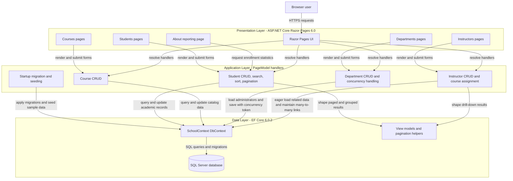
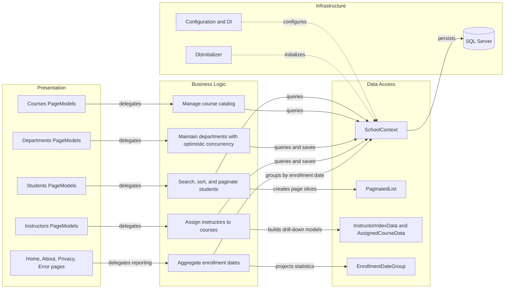

# Architecture Diagram

ContosoUniversity is a single ASP.NET Core Razor Pages application that serves server-rendered academic administration pages and persists data through Entity Framework Core. The solution has one deployable web frontend, one EF Core data access layer, and one SQL Server-backed relational store.

## Application Architecture

### Technology Stack Summary

| Layer | Technology | Version | Purpose |
| --- | --- | --- | --- |
| Presentation | ASP.NET Core Razor Pages | 6.0 | Server-rendered web UI for university administration workflows |
| Application | PageModel handlers | 6.0 | Executes CRUD, search, drill-down, and concurrency-aware update flows |
| Data Access | Entity Framework Core with SQL Server provider | 6.0.2 | Maps entities, runs migrations, and issues LINQ-backed SQL queries |
| Data Store | SQL Server / LocalDB connection string | Configured in appsettings | Stores students, instructors, departments, courses, enrollments, and office assignments |
| Bootstrap | EF Core migrations plus DbInitializer | 6.0.2 | Creates schema on startup and seeds baseline academic data |

### Data Storage & External Services

The application uses a single SQL Server-compatible relational database configured through the `SchoolContext` connection string. No message brokers, caches, or third-party HTTP integrations were found; the only external dependency captured in repository metadata is the SQL Server service connection used by EF Core.

### Key Architectural Decisions

- Uses a monolithic Razor Pages design where UI handlers query `SchoolContext` directly instead of introducing a separate service or repository layer.
- Applies EF Core migrations and sample data seeding during startup so a fresh environment becomes usable before the first request is served.
- Handles richer read models with eager loading and helper view models, such as instructor drill-downs and paginated student listings.

## Component Relationships

### Component Inventory

| Component | Layer | Type | Responsibility |
| --- | --- | --- | --- |
| `Program` | Infrastructure | Startup | Registers Razor Pages and `SchoolContext`, applies migrations, seeds data, and configures middleware |
| `Pages/Students/*.cshtml.cs` | Presentation | Razor PageModels | Supports student list, details, create, edit, delete, and filtered pagination workflows |
| `Pages/Courses/*.cshtml.cs` | Presentation | Razor PageModels | Maintains course catalog records and department selections |
| `Pages/Departments/*.cshtml.cs` | Presentation | Razor PageModels | Manages department records and handles optimistic concurrency conflicts |
| `Pages/Instructors/*.cshtml.cs` | Presentation | Razor PageModels | Maintains instructors, office assignments, assigned courses, and course enrollment drill-downs |
| `Pages/About.cshtml.cs` | Presentation | Razor PageModel | Produces grouped enrollment statistics for reporting |
| `SchoolContext` | Data Access | EF Core DbContext | Exposes entity sets and configures table mappings and the instructor-course many-to-many relationship |
| `PaginatedList<T>` | Data Access | Helper | Creates paged student result sets from LINQ queries |
| `InstructorIndexData`, `AssignedCourseData`, `EnrollmentDateGroup` | Data Access | View models | Shape related entity data for instructor and reporting views |
| `DbInitializer` | Infrastructure | Seed component | Inserts baseline students, departments, courses, instructors, enrollments, and office assignments |
