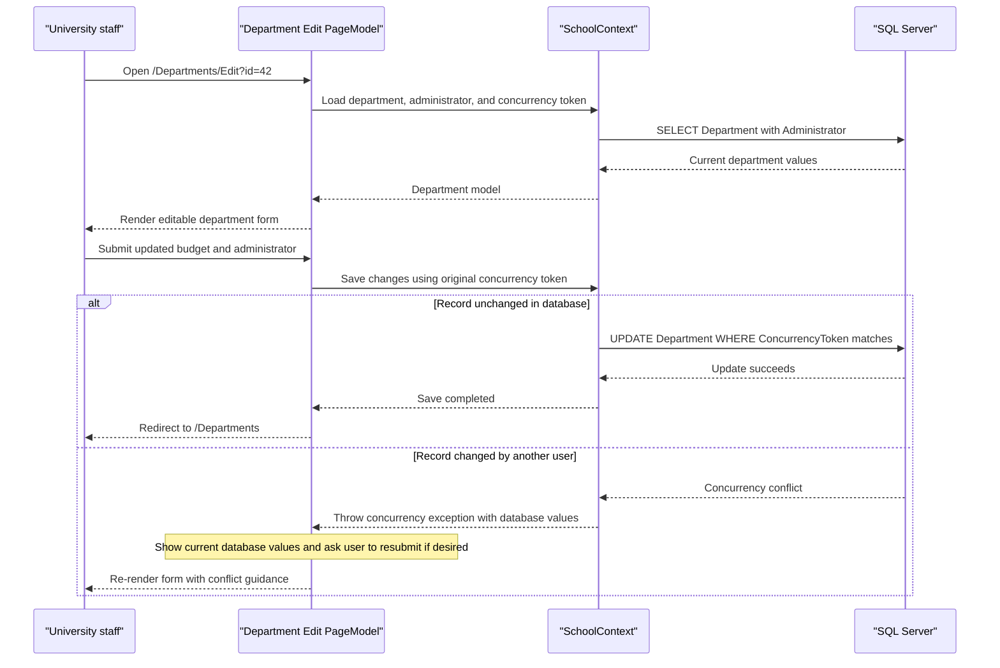

# Core Business Workflows

ContosoUniversity supports academic administration tasks for a university, letting staff maintain students, courses, departments, and instructors through server-rendered pages. Its workflows focus on roster maintenance, teaching assignment management, and administrative updates with basic business safeguards such as validation and concurrency checks.

## Domain Entities

| Entity | Service / Bounded Context | Description | Key Relationships |
| --- | --- | --- | --- |
| Student | ContosoUniversity / Academic Records | Represents an enrolled learner and the primary subject of roster management | Linked to many `Enrollment` records |
| Course | ContosoUniversity / Course Catalog | Represents a course offering with title, credits, and owning department | Belongs to one `Department`, linked to many `Enrollment` records, taught by many `Instructor` records |
| Enrollment | ContosoUniversity / Academic Records | Captures a student's participation and grade in a course | Bridges `Student` and `Course` |
| Department | ContosoUniversity / Academic Administration | Organizes courses, budget, start date, and assigned administrator | Owns many `Course` records and references one administrator `Instructor` |
| Instructor | ContosoUniversity / Faculty Management | Represents teaching staff and their assignments | May administer a `Department`, teach many `Course` records, and own one `OfficeAssignment` |
| OfficeAssignment | ContosoUniversity / Faculty Management | Stores an instructor's office location | One-to-one with `Instructor` |

## Service-to-Domain Mapping

| Service | Domain Context | Owned Entities | External Dependencies |
| --- | --- | --- | --- |
| ContosoUniversity | Academic administration | Student, Course, Enrollment, Department, Instructor, OfficeAssignment | SQL Server database via EF Core |

## Primary Workflows

### Workflow 1: Manage the student roster

Staff members browse `/Students`, search by name, change sort order, and page through the roster. When creating or editing a student, the page binds a `Student` model, validates required names and enrollment date formatting, and persists changes through `SchoolContext`. Delete operations load the student record, attempt removal, and surface an error flow if the database rejects the delete.

### Workflow 2: Maintain instructor teaching assignments

Staff members create or edit instructors from `/Instructors/Create` and `/Instructors/Edit`, optionally selecting multiple courses for each instructor. The handler loads available courses, maps selected course IDs into the instructor's `Courses` collection, clears empty office assignments, and saves the resulting many-to-many teaching relationship. The instructor index page can then drill into a selected instructor and course to show the related enrollments and students.

### Workflow 3: Update departments with optimistic concurrency

Department administrators use `/Departments/Edit` and `/Departments/Delete` to update budgets, administrators, and scheduling details. The workflow captures the current `ConcurrencyToken`, compares it during save, and if another user has changed or deleted the record, returns a message showing the latest values so the user can retry with current data.

## Cross-Service Data Flows

No cross-service or cross-process workflows were found because the solution is a single web application with one database. Data composition still occurs across domain areas within the same process: for example, instructor drill-down pages join instructors, courses, departments, enrollments, and students through EF Core eager loading and explicit navigation loading. The About page also aggregates student data into enrollment-date summaries, but all joins remain inside the monolith.

## Business Workflow Sequence

## Business Rules & Decision Logic

- Student creation and editing require valid name fields and enrollment dates before records are saved.
- Course records enforce a bounded credit range and a department association.
- Instructor assignment workflows treat selected course IDs as the source of truth for the instructor-course relationship and remove assignments that are no longer selected.
- Department edits and deletes rely on optimistic concurrency using a row-version token so conflicting administrative changes do not silently overwrite each other.
- Sample data seeding ensures the application starts with a consistent academic dataset for immediate use in a new environment.
