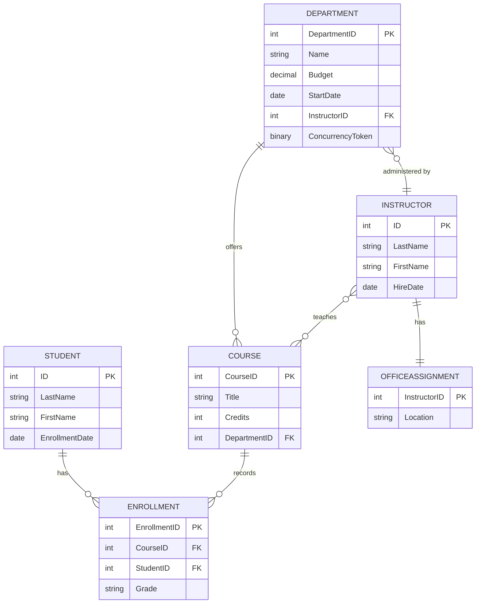

# Data Architecture & Persistence Layer

ContosoUniversity uses Entity Framework Core over a single SQL Server-backed relational database and models a compact academic domain with six core entity types. The persistence layer is centralized in one `DbContext`, with Razor Page handlers querying entities directly instead of routing through dedicated repositories.

## Database Configuration

| Service/Module | DB Type | Profile | Driver | Connection | Migration Tool |
| --- | --- | --- | --- | --- | --- |
| ContosoUniversity web app | SQL Server / LocalDB-compatible SQL Server | Default | `Microsoft.EntityFrameworkCore.SqlServer` 6.0.2 | `SchoolContext` connection string from configuration | EF Core migrations (`context.Database.Migrate()`) |
| ContosoUniversity web app | SQL Server / LocalDB-compatible SQL Server | Development | Same provider as default | Same `SchoolContext` key with development logging overrides | EF Core migrations plus `DbInitializer` sample data seeding |

## Data Ownership per Service

| Service | Tables Owned | ORM Framework | Caching | Notes |
| --- | --- | --- | --- | --- |
| ContosoUniversity | `Student`, `Enrollment`, `Course`, `Department`, `Instructor`, `OfficeAssignment`, and the implicit instructor-course join table | EF Core 6.0.2 | None discovered | All domain data lives in one shared database owned by the monolithic web app |

## Entity Model

## Key Repository Methods

| Service | Repository | Notable Methods | Purpose |
| --- | --- | --- | --- |
| ContosoUniversity | No dedicated repository layer | PageModel handlers query `SchoolContext` directly | The application uses `DbSet` access from Razor Pages instead of repository interfaces |
| ContosoUniversity | `SchoolContext.Students` | Filter by name, sort by last name or enrollment date, and page via `PaginatedList.CreateAsync` | Drives the searchable student roster |
| ContosoUniversity | `SchoolContext.Departments` | `Include(d => d.Administrator)` plus concurrency-token-aware update and delete flows | Supports department maintenance with optimistic concurrency |
| ContosoUniversity | `SchoolContext.Instructors` | `Include(i => i.OfficeAssignment)` and `Include(i => i.Courses).ThenInclude(c => c.Department)` | Supports instructor drill-down and course assignment management |
| ContosoUniversity | `SchoolContext.Courses` | Enumerate all courses to populate assignment and department dropdown data | Supports course catalog maintenance and instructor-course linking |
| ContosoUniversity | `SchoolContext.Students` grouped query | Group by `EnrollmentDate` into `EnrollmentDateGroup` | Produces enrollment statistics for the About page |

## Caching Strategy

No explicit caching provider, cache regions, or cache-aside annotations were found. Every workflow reads or writes directly through EF Core against the configured SQL Server database, which keeps the data path simple but means repeated lookups, such as instructor drill-downs and student list paging, always hit the database.

## Data Ownership Boundaries

The repository implements a single bounded context for university administration, so there are no cross-service ownership boundaries or shared-database coordination concerns between separate deployables. All reads and writes stay within the same application process and database. Cross-entity composition happens through EF Core navigation loading and query projection, such as loading instructors with courses and departments or students with enrollments and course details.
